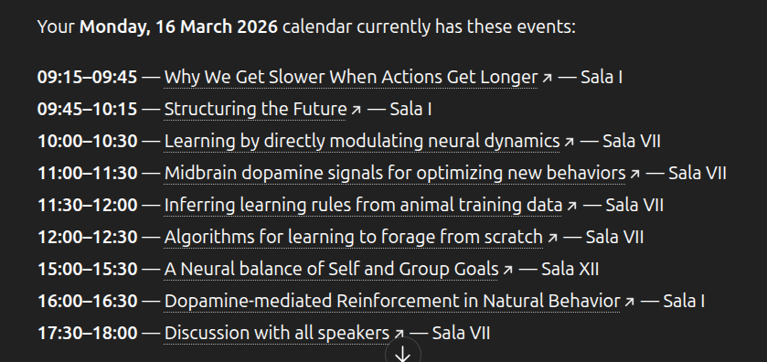

# Cosyne 2026

Single consolidated note for the only Cosyne attended so far.

## Conference leads and follow-ups

1. **Joshua Dudman — dopamine learning signal**
   - Nature paper: https://www.nature.com/articles/s41586-022-05614-z

2. **Francois Rivest (Canada) — timing using DDM**
   - Google Scholar: https://scholar.google.com/citations?hl=en&user=lb1fNb0AAAAJ&view_op=list_works&sortby=pubdate

3. **Exponential and accumulation are same?**
   - Look for relevant paper(s) by this author: https://scholar.google.com/citations?user=lMS8agIAAAAJ&hl=en

4. **Uchida — TD value calculation circuit**
   - bioRxiv preprint: https://www.biorxiv.org/content/10.1101/2025.09.18.677203v1

5. **Michael Leprori — Brown University**
   - Contravariance principle
   - Harder tasks → more unique solution

6. **Cell learning / single-cell “working memory”**
   - Aneta Koseska
   - eLife paper: https://elifesciences.org/articles/76825
   - Note: working memory in cells
   - ChatGPT explanation / summary link: https://chatgpt.com/s/t_69bad2ddfad081919e040b58a40c292e
   - Skeptical note: another example of overclaiming single-cell behaviour. They frame it as working memory, but it may just be slow decay of the signal caused by underlying biochemistry — basically the same flavor as habituation, i.e. decay of a remanent signal.

7. **Iain M. Banks**
   - Culture series
   - Note: often referred to informally here as “Ian Banks”

8. **Halstead complexity**
   - Constraint on AlphaEvolve's solutions
   - https://en.wikipedia.org/wiki/Halstead_complexity_measures

9. **Barlow vs Hebb**
   - Find/reference the relevant paper

## Related talks and references

### COSYNE 2024 talks

- Playlist: https://www.youtube.com/playlist?list=PL9YzmV9joj3EjkmmUEodJNDq9ekI7iFjq
- Session 3
  - What is intelligence — life and prediction are safe. How order emerges out of chaos.
  - Estrogen regulates dopamine and enhances learning by suppressing re-uptake of dopamine.
  - Ching Fang, Abbott’s lab — adding auxiliary loss helps better learning; multi-region modelling using Deep RL.
  - Christopher Zimmerman — learning from events that happened well in the past (hours before); shows how a brain region is identified.
  - Neural coding.
  - Srjan Osdac — geometry of responses in IC, A1; how manifolds (PC-1,2,3) change with time (100 ms blocks).

## Interpretability

- **Belief dynamics**
  - Paper: https://arxiv.org/abs/2511.00617
- **Rabbit hull paper**
  - Task geometry paper
- **Marginal value theorem**
  - For foraging; visiting time is proportional to reward rate
- **Mechanical problem solving in mice**
  - Task where mice have to do lever presses / slide things to get reward
  - Potentially a good paper for compositionality
- **Dragon king theory**
- **BBP phase transition**
  - The BBP phase transition (named after Jinho Baik, Gérard Ben Arous, and Sandrine Péché) describes a phenomenon in Random Matrix Theory where the largest eigenvalue of a “spiked” random matrix suddenly detaches from the main bulk of eigenvalues once the strength of a signal exceeds a critical threshold.
  - Usage note: neural network training — analyze the Hessian (curvature) of the loss landscape at initialization to see whether a gradient-based method can “find” the signal.

## Imported from Google Keep (2026-03-23)

### Workshop fragment
- BBP phase transition
- Representation for motor output, not decoding

### Workshop image

