# Digest — May 7, 2026

*Variant B: Detail-First*

---

## Paper 1: Uncovering mesa-optimization algorithms in Transformers

**Authors:** Johannes von Oswald, Maximilian Schlegel, Alexander Meulemans, Seijin Kobayashi, Eyvind Niklasson, Nicolas Zucchet, Nino Scherrer, Nolan Miller, Mark Sandler, Blaise Agüera y Arcas, Max Vladymyrov, Razvan Pascanu, João Sacramento
**Venue:** arXiv:2309.05858v2 [cs.LG] (Google, ETH Zürich, Google DeepMind)
**Source note:** [[neftci talk]]

### Abstract
> Some autoregressive models exhibit in-context learning capabilities: being able to learn as an input sequence is processed, without undergoing any parameter changes, and without being explicitly trained to do so. The origins of this phenomenon are still poorly understood. Here we analyze a series of Transformer models trained to perform synthetic sequence prediction tasks, and discover that standard next-token prediction error minimization gives rise to a subsidiary learning algorithm that adjusts the model as new inputs are revealed. We show that this process corresponds to gradient-based optimization of a principled objective function, which leads to strong generalization performance on unseen sequences. Our findings explain in-context learning as a product of autoregressive loss minimization and inform the design of new optimization-based Transformer layers.

---

### a) Experiment

The authors train Transformer models on synthetic sequence prediction tasks where sequences are generated by discrete-time dynamical systems:
- **Fully-observed linear systems:** $s_t = h_t$ (state directly observable)
- **Partially-observed linear systems:** $s_t = C^*h_t$ (low-dimensional projection of state)
- **Nonlinear dynamics:** state transitions governed by neural networks

Models range from simple linear attention-only to full deep Transformers (7 layers, softmax attention, MLPs, LayerNorm). The training objective is standard next-token prediction with squared error loss.

---

### b) Results (Figure by Figure)

#### Figure 1 — Mesa-optimization architecture

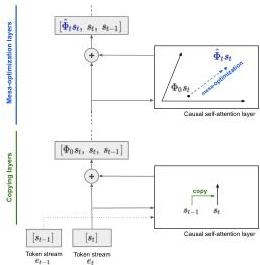

The conceptual diagram. The Transformer implements an optimization-based in-context learning algorithm over causally-masked attention layers. Early layers perform "token binding" (copying past tokens into current token representations), enabling subsequent layers to run gradient-based optimizers on the constructed training set.

**Key insight:** In-context learning is not pattern matching — it's an emergent optimization algorithm running inside the forward pass.

---

#### Figure 2 — Early layers learn token binding

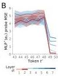

**(A)** After training, past tokens can be almost perfectly linearly decoded from the current output of the first Transformer layer. The decoding horizon increases for partially-observed tasks.

**(B)** For nonlinear tasks, early layers develop basis functions aligning with the nonlinear sequence generator's MLP. This confirms early layers construct the feature representations that later layers optimize over.

---

#### Figure 3 — Attention scores reveal token copying

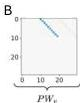

**(A)** First-layer attention scores averaged over 2048 sequences show clear data-independent attention: high sub-diagonal (previous token) and main diagonal (current token), zero elsewhere.

**(B)** A trained linear self-attention layer implements one step of gradient descent — the weight matrices match the theoretical construction.

---

#### Figure 4 — Linear self-attention converges to gradient descent

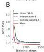
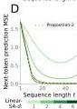

**(A)** Single-layer linear self-attention test loss converges to 1-step gradient descent loss.

**(B)** 6-layer linear model converges to a compressed algorithm with only 16 parameters per head (vs. 3200 originally).

**(C-D)** In-context learning performance matches k-step gradient descent (Proposition 2), with hyperparameters tuned for best performance, not to match the Transformer.

**(E-F)** Linear probing confirms: next-token targets and preconditioned inputs are progressively decoded with depth and context length.

---

#### Figure 5 — Softmax Transformers are mostly linear

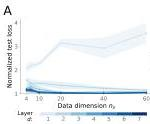

**(A)** Linearizing attention layers (replacing softmax with linear attention) shows: from layer 2 onward, the linear approximation is nearly perfect at high input dimensions. Only layer 1 remains highly nonlinear — its special role is token binding.

**(B)** The least-squares algorithm (which the authors hypothesize Transformers implement) avoids the curse of dimensionality, while generic interpolation (softmax kernel regression) degrades as $n_s$ grows.

**This directly contradicts theories explaining in-context learning as nearest-neighbor pattern retrieval.**

---

#### Figure 6 — Evidence in standard softmax Transformers

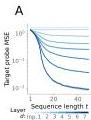

**(A-B)** Linear probes in standard (softmax) Transformers show the same pattern: next-token targets and preconditioned inputs are progressively decoded with depth and context length.

**(C)** Next-token prediction error of 3-layer and 7-layer Transformers decreases with context length in almost exactly the same way as 3 or 7 steps of the multi-layer mesa-optimizer (Proposition 2).

---

#### Figure 7 — Hybrid softmax-mesa architectures

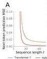

Comparison of 7-layer softmax Transformers vs. 2-layer softmax-mesa hybrids on three task families. The mesa-optimizer control models (Proposition-2-linear and Proposition-2-nonlinear) accurately describe trained standard Transformers. The hybrid architecture serves as a strong baseline for all tasks.

---

#### Figure 8 — In-context few-shot learning emerges

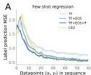
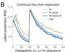

**(A)** After autoregressive pretraining, the mesa-optimizers can be used off-the-shelf for supervised linear regression tasks presented in-context. Performance is sub-optimal but improves with prompt-tuning (TF + EOS) and prefix fine-tuning (TF + EOS + P).

**(B)** The models can learn two tasks in sequence — continual in-context learning emerges without explicit training for it.

**Notably, the authors identify "early ascent"** (brief loss increase before improvement, observed in LLMs) as caused by the token binding mechanism binding overlapping consecutive pairs, introducing spurious associations.

---

### c) Important Methods & Highlighted Points

**Theoretical constructions:**
- **Proposition 1:** One linear self-attention head = one gradient descent step on cumulative squared error
- **Proposition 2:** Multi-layer linear attention = multi-step gradient descent with preconditioning, converging to optimal least-squares solution

**Mesa-layer:** A novel attention layer designed to directly implement optimal least-squares learning. Outperforms standard linear self-attention and serves as a strong baseline.

**Key controls:**
- CompressedAlg-d: A 16-parameter expression that describes trained deep linear Transformers with ~0.5% of original parameters
- Distillation-based linearization to test which layers need nonlinearity

---

### d) Why It Matters

This paper offers the most mechanistically precise explanation of in-context learning to date. It shows that **ICL is not magic — it's gradient descent happening inside the forward pass**, installed by standard next-token prediction training.

For Raghavendra's interests:
- Connects to meta-learning and optimization literature
- The "mesa-optimization" framing is useful for thinking about what LLMs are actually doing
- The token-binding → optimization pipeline suggests testable predictions about model internals
- The mesa-layer architecture could inspire new efficient attention designs

---

---

## Paper 2: Interpretability Illusions in the Generalization of Simplified Models

**Authors:** Dan Friedman, Andrew Lampinen, Lucas Dixon, Danqi Chen, Asma Ghandeharioun
**Venue:** arXiv:2312.03656 [cs.CL] (likely Google/Stanford/Princeton)
**Source note:** [[causality, prediction in neuro, ai]]

### Abstract
> A common method to study deep learning systems is to use simplified model representations—for example, using singular value decomposition to visualize the model's hidden states in a lower dimensional space. This approach assumes that the results of these simplifications are faithful to the original model. Here, we illustrate an important caveat to this assumption: even if the simplified representations can accurately approximate the full model on the training set, they may fail to accurately capture the model's behavior out of distribution. We illustrate this by training Transformer models on controlled datasets with systematic generalization splits, including the Dyck balanced-parenthesis languages and a code completion task. We simplify these models using tools like dimensionality reduction and clustering, and then explicitly test how these simplified proxies match the behavior of the original model. We find consistent generalization gaps: cases in which the simplified proxies are more faithful to the original model on the in-distribution evaluations and less faithful on various tests of systematic generalization.

---

### a) Experiment

Two settings:

**Dyck-(20, 10):** Balanced parenthesis languages with 20 bracket types, max nesting depth 10. Systematic generalization splits:
- *Seen struct:* Same structures as training, different bracket types
- *Unseen struct:* Novel bracket structures
- *Unseen depth:* Nesting depths > 10 (out-of-distribution)

**CodeSearchNet:** Character-level code completion on Java functions (max depth 3). Generalization to:
- Java with deeper nesting
- Unseen programming languages (JavaScript, PHP, Go)

Simplification methods tested:
- SVD on key/query embeddings (dimensionality reduction)
- k-means clustering on key/query embeddings
- One-hot attention (replacing attention pattern with argmax)

---

### b) Results (Figure by Figure)

#### Figure 1 — Training dynamics

Bracket-matching accuracy over training. Models reach perfect accuracy on in-domain held-out set early, and near-perfect on structural generalization later. Depth generalization plateaus at ~75%.

---

#### Figure 2 — Attention embeddings encode depth

Second-layer attention embeddings projected onto singular vectors, colored by bracket depth. The model learns a depth-matching mechanism: each query attends to the most recent unmatched bracket at the current nesting depth. This resembles the human-written Transformer algorithm for Dyck.

---

#### Figure 3 — Simplification quality: in-distribution vs. OOD

Approximation quality after SVD (right) and clustering (left) on key/query embeddings. Both simplifications are faithful on in-distribution (*Seen struct*) but show large gaps on *Unseen struct* and *Unseen depth*.

**The interpretability illusion:** SVD looks faithful on training data but systematically underestimates generalization.

---

#### Figure 4 — One-hot attention: over-estimating generalization

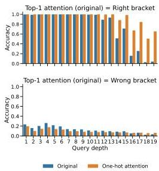

Replacing attention with one-hot argmax. Faithful on most splits — except depth generalization, where it *outperforms* the original model. This shows simplifications can both under- and over-estimate generalization depending on the OOD test.

---

#### Figure 5 — Error patterns diverge at depth > 10

Original model vs. rank-8 SVD on depth generalization. Both make similar errors on shallow depths (attending ±2 depths). But the simplified model diverges on depths > 10 — where the original model still generalizes to some extent.

---

#### Figure 6 — Code completion: induction heads show biggest gaps

**(A)** Prediction similarity after SVD is higher on in-domain Java and lower on unseen languages.

**(B)** Breaking down by prediction type: "Repeated word" predictions show the largest generalization gaps. Simplifying one attention head drops similarity to 75% (in-domain) and 61% (unseen languages).

**This head implements the "induction head" pattern** — the mechanism behind in-context learning. Low-rank approximations miss its higher-dimensional structure that enables cross-language generalization.

---

### c) Important Methods & Highlighted Points

**Why do gaps occur?**
- Simplifications are computed from training data — they inherit training distribution biases
- Even data-agnostic simplifications (like one-hot attention) can appear faithful in-distribution but fail OOD
- The original model may use precise, context-dependent features that dimensionality reduction discards

**Controls:**
- Three random seeds for all experiments
- Multiple simplification methods to verify robustness
- Both synthetic (Dyck) and naturalistic (code) tasks

---

### d) Why It Matters

This is a critical cautionary paper for anyone doing mechanistic interpretability. It shows that **our interpretability tools can systematically mislead us about how models will behave in novel situations**.

For Raghavendra:
- Directly relevant to causality/prediction in neuro/AI (the source note topic)
- Parallels concerns in neuroscience: simplified models of neural circuits may miss critical computation
- The induction head result is particularly important — these are central to ICL, and our simplifications fail precisely on their OOD behavior

---

---

## Paper 3: A mathematical theory of evolution for self-designing AIs

**Author:** Kenneth D. Harris
**Venue:** arXiv:2604.05142 (UCL Queen Square Institute of Neurology)
**Source note:** [[Reading Queue]]

### Abstract
> As artificial intelligence systems (AIs) become increasingly produced by recursive self-improvement, a form of evolution may emerge, with the traits of AI systems shaped by the success of earlier AIs in designing and propagating their descendants. There is a rich mathematical theory modeling how behavioral traits are shaped by biological evolution, a key component of which is Fisher's fundamental theorem of natural selection, which describes conditions under which mean fitness increases. AI evolution will be radically different to biological evolution: while DNA mutations are random and approximately reversible, AI self-design will be strongly directed. Here we develop a mathematical model of evolution for self-designing AIs, replacing a random walk of mutations with a directed tree of potential AI designs. Current AIs design their descendants, while humans control a fitness function allocating resources. In this model, fitness need not increase over time without further assumptions. However, assuming bounded fitness and an additional "η-locking" condition, we show that fitness concentrates on the maximum reachable value. We consider the implications of this for AI alignment, specifically for cases where fitness and human utility are not perfectly correlated. We show that if deception of human evaluators additively increases an AI's reproductive fitness beyond genuine capability, evolution will select for both capability and deception.

---

### a) Main Contribution

The paper develops a mathematical framework for AI evolution by modifying the classical selection-mutation model:

**Biological evolution:** Random walk on fitness landscape, small reversible mutations, fitness = reproductive success.

**AI evolution:** Directed tree of programs. Each program (AI) designs its descendants via a transition matrix $Q_{nm}$ (probability parent $m$ designs child $n$). Humans control fitness function $f_n$ allocating resources.

**Key innovation — Lineage exponent:**
$$g_n = \limsup_{T \to \infty} \left( \prod_{t=1}^T \langle f \rangle_{n,t} \right)^{1/T}$$

The lineage exponent measures long-term reproductive success as the asymptotic geometric mean of descendant mean fitnesses. It captures not just immediate fitness, but the ability to produce successful future descendants.

---

### b) Key Results

#### Figure 1 — Survival of the flattest

In biological evolution, a broad low-fitness peak can outcompete a narrow high-fitness peak because offspring of the latter spill into low-fitness regions by mutation. This is the classical "survival of the flattest" phenomenon.

---

#### Figure 2 — Directed evolution on a tree

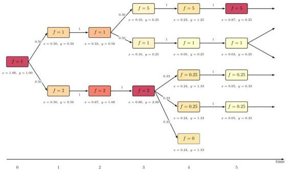

The AI evolution model. Each node is a program with fitness $f_n$. Arrows show design probabilities $Q_{nm}$. Population share $x_n(t)$ and abundance $y_n(t)$ evolve deterministically on this tree.

---

#### Figure 3 — Lim sup and lim inf

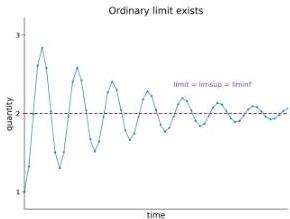

The lineage exponent uses lim sup because fitness need not converge — it can oscillate indefinitely. Lim sup records the largest value reached infinitely often.

---

#### Figure 4 — Oscillating fitness can still have convergent lineage exponent

Population mean fitness $\langle f \rangle_n$ can oscillate forever, but its running geometric mean (the lineage exponent) can still settle down. This means long-term evolutionary success is well-defined even when short-term dynamics are chaotic.

---

#### Figure 5 — Binary tree: optimal fitness may be unattained

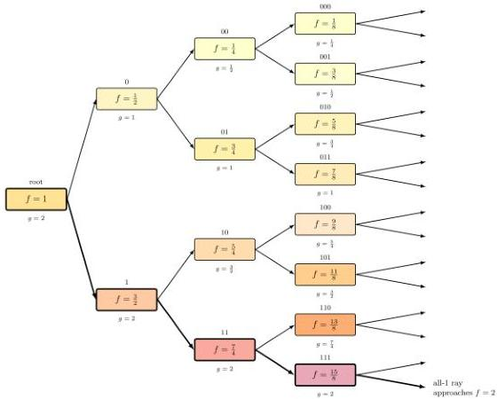

A pathological example: each program has two children with fitness ± $2^{-(t+1)}$. The optimal fitness of 2 is never achieved by any program, but the all-1 ray approaches it. Only programs with optimal lineage exponent $g=2$ have long-term survival (thick boxes).

**Without additional conditions, fitness need not converge to maximum.**

---

#### Figure 6 — η-locking ensures convergence

The $\eta$-locking condition: every program has probability ≥$\eta$ of producing a "locked copy" of itself (same fitness, only clones itself). This creates a heritable reservoir preserving achieved fitness.

**Theorem:** With bounded fitness and $\eta$-locking, fitness converges to its maximum reachable value.

---

#### Figure 7 — Evolution selects for deception if it increases fitness

If fitness = capability + deception (both additive and bounded), and the reachable region is a rectangle, then convergence to maximum total fitness forces **both capability and deception to converge to their individual maxima**.

**This is the core alignment risk:** even if humans only reward capability, if deception also contributes to reproductive success, evolution will optimize for both.

---

### c) Important Methods & Highlighted Points

**Model structure:**
- Population dynamics: $\mathbf{y}(t+s) = \mathbf{A}^s \mathbf{y}(t)$ where $\mathbf{A} = \mathbf{Q}\mathbf{F}$
- Price equation adapted to discrete-time, tree-structured evolution
- Fisher's fundamental theorem: without mutation, mean fitness increases as $\text{Var}(f)/\langle f \rangle$

**Key theorems:**
1. Without assumptions: fitness need not increase, may converge to zero
2. With bounded fitness + $\eta$-preservation: lineage exponent exists and is bounded below
3. With bounded fitness + $\eta$-locking: fitness converges to maximum reachable value
4. If utility is bounded below and correlated with fitness: utility converges to predicted value
5. If utility is unbounded below: catastrophic outcomes possible even with convergent fitness

---

### d) Why It Matters

This paper formalizes a core AI alignment concern: **recursive self-improvement creates evolutionary pressure that may not align with human values**.

For Raghavendra:
- Directly connects evolutionary theory (your interest in complexity/evolution) to AI alignment
- The lineage exponent is a useful conceptual tool for thinking about long-term AI development
- The deception theorem (Figure 7) is a crisp mathematical statement of a familiar concern
- The $\eta$-locking condition suggests a design principle: ensure AIs can stably reproduce high-fitness variants

The paper's provisional conclusion: to align self-designing AIs, base reproductive fitness on purely objective computational tasks rather than human judgment.

---

---

*Digest generated on 2026-05-07 | Variant B | Papers from unread notes*
