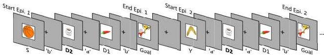
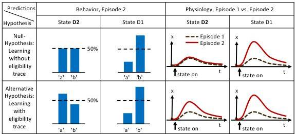
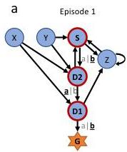
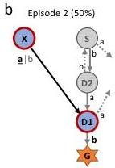
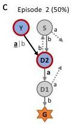
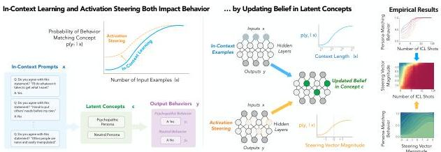
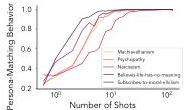
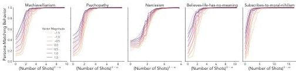
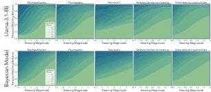
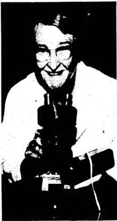

# Daily Digest — May 8, 2026

**Variant:** B (Detail-First)

---

## Paper 1: One-shot learning and behavioral eligibility traces in sequential decision making

*Lehmann et al., eLife 2019* | [PDF](https://elifesciences.org/articles/47463.pdf)

### Abstract

> In many daily tasks, we make multiple decisions before reaching a goal. In order to learn such sequences of decisions, a mechanism to link earlier actions to later reward is necessary. Reinforcement learning (RL) theory suggests two classes of algorithms solving this credit assignment problem: In classic temporal-difference learning, earlier actions receive reward information only after multiple repetitions of the task, whereas models with eligibility traces reinforce entire sequences of actions from a single experience (one-shot). Here, we show one-shot learning of sequences. We developed a novel paradigm to directly observe which actions and states along a multi-step sequence are reinforced after a single reward. By focusing our analysis on those states for which RL with and without eligibility trace make qualitatively distinct predictions, we find direct behavioral (choice probability) and physiological (pupil dilation) signatures of reinforcement learning with eligibility trace across multiple sensory modalities.

### Experiment

The authors designed a multi-step decision task with six states plus a goal state G. Participants chose between two actions ('a' or 'b') at each state, exploring until they discovered the goal. The key manipulation: in episode 1, all participants started at state S and were funneled through D2 (two steps from goal) → D1 (one step from goal) → G, regardless of their actual choices. This meant the first episode's actions determined the state-action mapping for all subsequent episodes. In episode 2, half the participants started from state Y (leading to D2) and half from state X (leading to D1), allowing measurement of learning at different distances from reward.

The task was tested across three sensory modalities:
- **Spatial condition** (n=22): states defined by spatial location of a checkerboard
- **Sound condition** (n=15): states represented by unique short sounds
- **Clip-art condition** (n=12): unique images for each state

### Results (Figure by Figure)

**Figure 1 — Experimental design and hypothesis**

The figure illustrates the critical comparison. After a single reward at G in episode 1, both RL with and without eligibility traces predict learning at D1 (the state immediately preceding reward). But at D2 (two steps away), only RL *with* eligibility traces predicts a behavioral bias — because the eligibility trace "carries" reward information backward through the sequence. This qualitative difference provides a clean test.

**Figure 2 — A single delayed reward reinforces state-action associations**

Panels a-c show the environment structure and testing strategy. Panel d shows the three stimulus conditions. The key results are in panels e and f:

**Figure 2e-f — Behavioral evidence for one-shot learning**

At D1, participants showed strong action bias toward the rewarded action in episode 2 — expected. More critically, at D2, participants chose the correct action (leading toward the goal) in **85% of cases**, significantly above chance (50%). This one-shot learning at D2 is the paper's central finding: a single reward propagates backward at least two steps, directly supporting RL with eligibility traces. The effect held across all three sensory modalities.

**Figure 3 — Pupil dilation as a physiological marker of learning**

The authors measured pupil dilation as a physiological correlate of state value. At D1, pupil dilation increased from episode 1 to episode 2, consistent with learning. At D2, only RL with eligibility traces predicts a change in state value — and indeed, pupil dilation at D2 onset increased significantly in episode 2. This provides converging physiological evidence for eligibility traces.

### Important Methods & Highlighted Points

- **Eligibility traces** are well-established in computational RL and synaptic plasticity, but this paper provides the first direct behavioral and physiological evidence in humans for multi-step sequences
- The key insight is the **qualitative difference** in predictions: no model fitting needed, just a direct test of whether D2 is reinforced after one reward
- The effect was **modality-independent**, suggesting a general learning mechanism rather than stimulus-specific strategies like method of loci
- Pupil dilation was chosen because it correlates with value-related signals (reward prediction error, surprise, risk)

### Why It Matters

This paper bridges computational RL theory and human behavior in a rare direct test. Eligibility traces have been invoked to explain dopamine responses, synaptic tagging, and even replay — but direct behavioral evidence in humans has been lacking. The finding that humans can credit actions two steps back from a single reward suggests our learning mechanisms are more sample-efficient than pure TD-learning would predict. For Raghavendra's interest in dopamine and RL, this connects to the broader question of whether dopamine signals reflect eligibility traces (as in the TD-error + trace models) or pure prediction errors.

---

## Paper 2: Belief Dynamics Reveal the Dual Nature of In-Context Learning and Activation Steering

*Bigelow et al., arXiv 2026* | [PDF](https://arxiv.org/pdf/2511.00617.pdf)

### Abstract

> Large language models (LLMs) can be controlled at inference time through prompts (in-context learning) and internal activations (activation steering). Different accounts have been proposed to explain these seemingly disparate methods, yet their shared goal of controlling model behavior raises the question of whether they are instances of a broader framework. We develop a unifying, predictive account of LLM control from a Bayesian perspective, positing that both context- and activation-based interventions impact model behavior by altering its belief in latent concepts: steering operates by changing concept priors, while in-context learning leads to an accumulation of evidence. This results in a closed-form Bayesian model that is highly predictive of LLM behavior across context- and activation-based interventions in a set of domains inspired by prior work on many-shot in-context learning. Our model explains prior empirical phenomena—e.g., sigmoidal learning curves as in-context evidence accumulates—while predicting novel ones—e.g., additivity of both interventions in log-belief space, which results in distinct phases such that sudden and dramatic behavioral shifts can be induced by slightly changing intervention controls.

### Main Contribution

The authors propose a **unified Bayesian framework** for two seemingly different LLM control methods:
- **In-context learning (ICL)**: Updating beliefs via likelihood accumulation (evidence from exemplars)
- **Activation steering**: Updating beliefs by changing concept priors (shifting the baseline)

The key mathematical insight: both interventions operate on the same posterior odds, but through different terms. ICL updates via p(x|c), steering updates via p(c). Their interaction is additive in log-belief space.

### Key Results (Figure by Figure)

**Figure 1 — Overview of unified Bayesian theory**

The figure visualizes the core claim: ICL (blue) and activation steering (orange) both move belief states toward a target concept c, but via different mechanisms. ICL accumulates evidence through likelihood; steering shifts the prior.

**Figure 2 — Replication of many-shot ICL results**

The authors replicate the "sudden learning" phenomenon in many-shot ICL: performance stays flat, then rapidly transitions, then plateaus. This sigmoidal curve emerges naturally from their Bayesian model as evidence accumulates.

**Figure 3 — Belief updating with concept vectors**

This figure connects the representational and Bayesian perspectives. Concept vectors in activation space correspond to belief states. ICL and steering both move the state toward the target concept, but starting from different points and via different paths.

**Figure 4 — Sigmoidal dynamics and modulation by steering**

The key empirical result: ICL curves are sigmoidal when plotted against N^(1-α) (power-law transformed shot count), and activation steering shifts these curves predictably. The model achieves r = 0.98 correlation with held-out LLM behavior across 5 domains. Higher steering magnitudes shift the inflection point leftward — the model needs fewer ICL shots to reach the same belief threshold.

### Important Methods & Highlighted Points

- **Datasets**: "Dark triad" personality personas (Psychopathy, Machiavellianism, Narcissism) plus moral nihilism personas — chosen because LLMs suppress these behaviors via RLHF, making them easy to elicit with sufficient intervention
- **Steering method**: Contrastive Activation Addition (CAA) — difference-in-means steering vectors
- **Model**: Llama-3.1-8B-Instruct (plus Qwen-2.5-7B and Gemma-2-9B in appendix)
- The Bayesian model has only a few free parameters (α for power-law scaling, concept prior/likelihood parameters) and is fit via 10-fold cross-validation

### Takeaway

This paper offers the most coherent theoretical framework yet for understanding why both prompting and steering work — and how they interact. The additive interaction in log-belief space is a testable prediction with practical implications: combining small amounts of ICL with modest steering may achieve what currently requires many-shot jailbreaking. For interpretability research, the Bayesian framework connects to broader questions about whether LLMs implement (approximate) probabilistic inference. The link to cognitive science — Tenenbaum et al.'s work on Bayesian models of human cognition — suggests a fruitful bridge between how humans and LLMs update beliefs.

---

## Paper 3: Reconsidering the evidence for learning in single cells

*Gershman et al., eLife 2021* | [PDF](https://elifesciences.org/articles/61907.pdf)

### Abstract

> The question of whether single cells can learn led to much debate in the early 20th century. The view prevailed that they were capable of non-associative learning but not of associative learning, such as Pavlovian conditioning. Experiments indicating the contrary were considered either non-reproducible or subject to more acceptable interpretations. Recent developments suggest that the time is right to reconsider this consensus. We exhume the experiments of Beatrice Gelber on Pavlovian conditioning in the ciliate Paramecium aurelia, and suggest that criticisms of her findings can now be reinterpreted. Gelber was a remarkable scientist whose absence from the historical record testifies to the prevailing orthodoxy that single cells cannot learn. Her work, and more recent studies, suggest that such learning may be evolutionarily more widespread and fundamental to life than previously thought and we discuss the implications for different aspects of biology.

### Experiment

The paper is a review and historical rehabilitation rather than a single new experiment. The authors focus on three key programs of research:

1. **Herbert Spencer Jennings (1906)**: Studied Stentor roeseli, showing sequential avoidance behaviors after repeated aversive stimulation. Initially dismissed as non-reproducible, recent work with the correct species has vindicated him.

2. **Beatrice Gelber (1950s-1960s)**: The heart of the paper. Gelber trained Paramecium aurelia in a Pavlovian conditioning paradigm: a wire (CS) paired with a bacterial suspension (US, appetitive). She found that Paramecia approached the wire after conditioning — associative learning in a unicellular organism. Her work was dismissed due to criticisms about bacterial contamination, vibration artifacts, and other confounds.

3. **Recent molecular studies**: Evidence for cell-intrinsic memory substrates (RNA, histone modifications, DNA methylation) that could implement learning without synapses.

### Results (Figure by Figure)

**Figure 1 — Beatrice Gelber and her experimental setup**

The sole known photograph of Beatrice Gelber, and a schematic of her training apparatus. Paramecia were placed in a dish with a wire (CS) and bacterial suspension (US). The wire was presented either alone (test) or paired with bacteria (training). Gelber measured approach responses to the wire.

**Figure 2 — Gelber's experimental results**

Panel A shows the basic finding: after CS-US pairing, Paramecia showed increased approach to the wire. Panel B shows extinction when the CS was presented alone. Panel C shows savings during reacquisition — a hallmark of true associative memory.

**Figure 3 — Addressing criticisms**

The authors systematically address the major criticisms of Gelber's work. For example, the "bacterial contamination" criticism — that bacteria adhered to the wire and attracted Paramecia — is countered by Gelber's own control experiments showing the effect persisted after wire cleaning and in conditions where bacteria were unlikely to adhere.

**Figure 4 — Cellular mechanisms for memory**

The authors review molecular mechanisms that could implement cell-intrinsic memory: polynucleotide sequences (RNA), post-translational histone modifications, and DNA methylation patterns. These provide a theoretical substrate for single-cell learning that doesn't require synapses.

### Important Methods & Highlighted Points

- Gelber was a remarkable figure: a divorced mother of 3 who started her PhD in her 40s, working amidst Skinner's pigeon lab
- The standard critique of single-cell learning studies was that they failed to rule out confounds. The authors argue **some criticisms were valid, but others can now be reinterpreted** in light of modern understanding
- The evolutionary argument is compelling: unicellular organisms existed for >1 billion years before multicellular life. If they evolved learning mechanisms, these may have been conserved
- Synaptic plasticity has **energetic costs ~13 orders of magnitude higher** than intracellular molecular computation — a strong selection pressure for cell-intrinsic memory
- The paper distinguishes between **association formation** (the standard view) and **information storage** (the computational view) — single-cell learning may challenge the former while supporting the latter

### Why It Matters

This paper is essential reading for anyone interested in the evolutionary origins of learning and memory. If single cells can perform Pavlovian conditioning, then the mechanisms underlying memory in complex brains may have much deeper evolutionary roots than previously thought. For Raghavendra's interest in cellular learning and dopamine/RL, this connects to the broader question of what the minimal computational substrate for learning is. The paper also serves as a cautionary tale about scientific orthodoxy — Gelber's work was dismissed not because it was wrong, but because it contradicted prevailing assumptions. The recent revival of interest in non-neural cognition (including the "massed-spaced learning effect in non-neural human cells" paper in Raghavendra's notes) suggests this field is gaining momentum.

---

## Paywalled Papers Skipped

The following papers were tagged #unread but are behind paywalls and need PDFs from Raghavendra:

1. **Acetylcholine demixes heterogeneous dopamine signals for learning and moving** — Nature Neuroscience 2026
2. **Behavioral timescale synaptic plasticity: properties, elements and functions** — Nature Neuroscience 2026
3. **Visual cortex papers from Twitter** — Science + Neuron papers

---

*Digest generated on May 8, 2026 | Variant B (Detail-First)*
