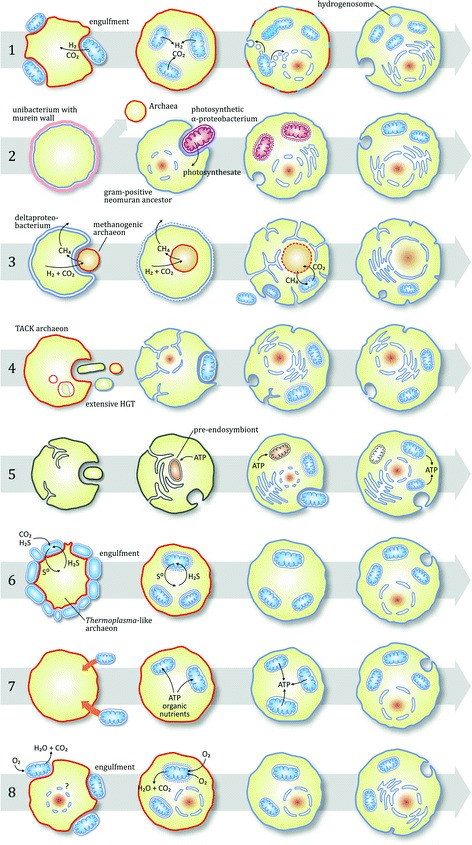
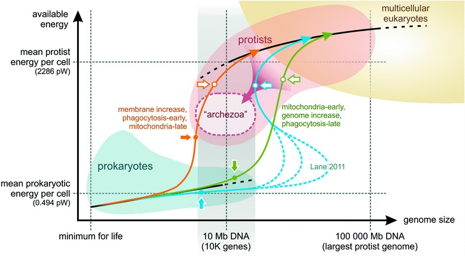
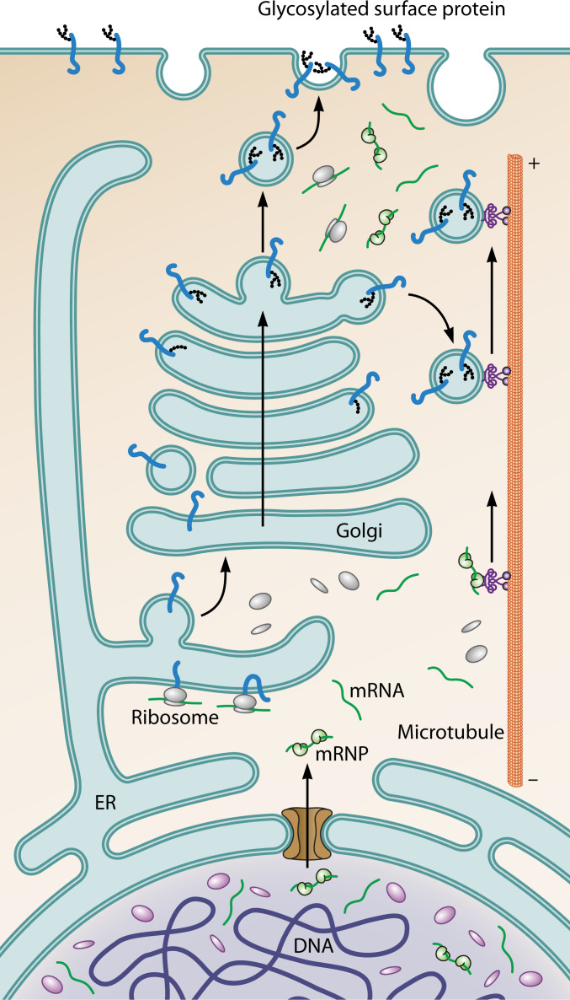
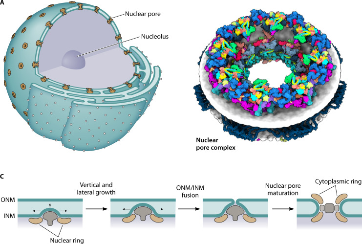
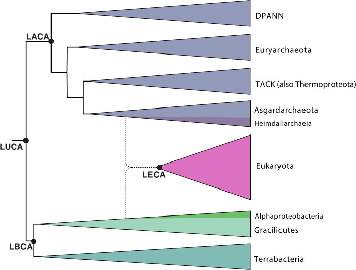
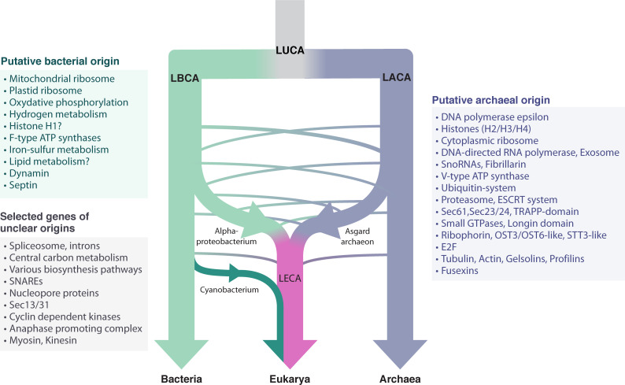
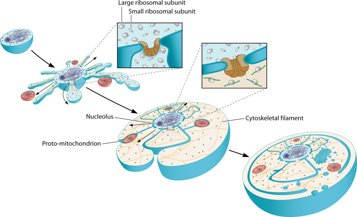

# Daily Digest — May 12, 2026

**Variant:** B (Detail-First)

**Note:** No papers were found with `#unread` tags in the current notes. Selected 3 open-access research papers from untagged notes in `content/2026/`. Figure extraction was performed directly from PMC open-access repositories; the Nature Neuroscience paper is summarized from available text (figures could not be extracted due to paywall).

---

## Paper 1: Acetylcholine demixes heterogeneous dopamine signals for learning and moving

*Nature Neuroscience 2026* | [DOI](https://doi.org/10.1038/s41593-026-02227-x) | [bioRxiv Preprint](https://www.biorxiv.org/content/10.1101/2024.05.03.592444v2)

### Abstract

> Midbrain dopamine neurons and their terminals in the striatum are implicated in reinforcement learning and motor control. Some evidence suggests that different dopamine neurons may be engaged in learning and movement, such that heterogeneous functions could derive from distinct groups of neurons. However, single dopamine neuron axon terminals span millimeters of neuropil, and heterogeneous dopamine signals have been observed at single recording sites in the dorsal striatum, suggesting that, for medium spiny neurons, dopamine receptor binding reflects multiplexed signals for learning and moving. Here we show that acetylcholine release exhibits distinct dynamics when dopamine encodes reward prediction errors (RPEs) or predicts upcoming movement vigor in rats performing a goal-directed decision-making task.

### Experiment

**Behavioral Task:** Self-paced temporal wagering task in rats (n = 16 rats, with subsets for DA and ACh recordings).

- Rats initiate trials by nose-poking in a central port
- An auditory cue indicates offered reward volume (5, 10, 20, 40, or 80 μl water)
- After fixation (~1s), a side LED indicates the reward port
- Rats can wait for an unpredictable delay or opt out to start a new trial
- Catch trials (15–25%) assess willingness to wait — a behavioral measure of valuation
- Blocks alternate between low (5–20 μl), high (20–80 μl), and mixed reward offers

**Neural Recordings:**
- **Dopamine:** Fiber photometry of GRABDA2h or GRABrDA3m sensors in dorsomedial striatum (DMS; n = 10 rats total)
- **Acetylcholine:** Fiber photometry of GRABACh4.3 sensor in DMS (n = 10 rats)
- **Dual recordings:** Simultaneous DA (red) and ACh (green) at same DMS site (n = 4 rats)
- Motion correction using mCherry or isosbestic control

**Key question:** How do striatal medium spiny neurons demultiplex heterogeneous dopamine signals for learning vs. movement?

### Results (Figure by Figure)

**Fig. 1: Temporal wagering task provides behavioral measures of reward expectations and movement**
- Rats initiate trials faster in high-reward blocks vs. low-reward blocks
- Time to opt out scales with offered reward volume
- DeepLabCut tracking reveals stereotyped orienting movements at task events (toward side LED, back to center)
- This separates reward-predictive cues from movement events in time, enabling independent analysis

**Fig. 2: Dopamine and acetylcholine in the DMS show distinct dynamics at reward-associated and movement-associated events**
- **Dopamine RPEs:** Phasic DA release at offer cue scales with reward volume; DA at reward cue scales inversely with delay (consistent with RPE)
- **Dopamine movement signals:** Phasic DA contralateral to recording hemisphere at orienting movements (both toward reward port and back to center)
- **Acetylcholine dips:** Prominent ACh dips at RPE events (offer cue, reward cue) — magnitude modestly scales with reward volume
- **Acetylcholine bursts:** Strong ACh bursts at contralateral orienting movements, matching the dopamine movement signal
- **Key finding:** ACh exhibits *dips* when DA encodes RPEs, but *bursts* when DA encodes contralateral movements

**Fig. 3: Dopamine correlates with learning when it lags cholinergic dips**
- At offer cue: dopamine RPE *lags* acetylcholine dip by ~100 ms
- At reward cue: dopamine RPE *precedes* acetylcholine dip by ~50 ms (because dip is aligned to reward delivery, not cue)
- Computational model: reward-volume-modulated RPE predicts trial initiation times
- Dopamine at offer cue predicts faster initiation on subsequent trial *only when* dopamine lags cholinergic dip
- This suggests the phase relationship between DA and ACh determines whether DA drives learning

**Fig. 4: Acetylcholine bursts at movement are necessary for movement-related dopamine to predict movement vigor**
- Contralateral ACh bursts correlate with movement vigor (head angular velocity)
- When ACh burst is present, movement-related DA predicts vigor; when absent, it does not
- This establishes ACh bursts as a gate for dopamine's motor effects

**Fig. 5: Optogenetic manipulation of cholinergic interneurons bidirectionally modulates dopamine signals and behavior**
- Photoactivation of cholinergic interneurons (CINs) during offer cue *suppresses* dopamine RPE and impairs learning
- Photoactivation during orienting movement *enhances* movement vigor
- Photoinhibition during offer cue *enhances* dopamine RPE and improves learning
- Photoinhibition during movement *impairs* movement vigor
- **Direct causal evidence:** ACh gates whether dopamine drives learning or movement

### Important Methods & Highlighted Points

- **GRAB sensors:** Genetically encoded fluorescent sensors for dopamine (GRABDA) and acetylcholine (GRABACh) enable fiber photometry with cell-type specificity
- **Dual-color imaging:** Red-shifted DA sensor + green ACh sensor at same site rules out location differences
- **DeepLabCut:** Markerless pose estimation for tracking head angle and speed
- **Optogenetics:** ChR2 and NpHR in cholinergic interneurons (ChAT-Cre rats) for causal manipulation
- **Cross-correlation analysis:** Reveals ~100 ms lag of DA behind ACh at RPE events

### Why It Matters

This paper provides a mechanistic answer to a longstanding puzzle: how can the same dopamine neurons signal both learning and movement? The answer is that acetylcholine acts as a dynamic gate. When ACh dips, DA drives learning (via RPEs); when ACh bursts, DA drives movement vigor. This is not a static anatomical segregation but a *temporal multiplexing* mechanism operating on moment-by-moment basis.

For Raghavendra's interests:
- **RL + motor control:** Shows how a single neuromodulator (DA) can serve heterogeneous functions through interaction with another (ACh)
- **Credit assignment:** The phase relationship between DA and ACh may be a biological solution to the credit assignment problem — determining when to learn vs. act
- **Parkinson's disease:** ACh-dopamine imbalance is a hallmark of PD; this work suggests the deficit is not just in DA but in the ACh gate that routes DA signals appropriately

---

## Paper 2: Breath-giving cooperation: critical review of origin of mitochondria hypotheses

*Kovács & Zs. | Biology Direct 2017* | [PMC Open Access](https://pmc.ncbi.nlm.nih.gov/articles/PMC5557255/)

### Abstract

> The origin of mitochondria is a unique and hard evolutionary problem, embedded within the origin of eukaryotes. The puzzle is challenging due to the egalitarian nature of the transition where lower-level units took over energy metabolism. Contending theories widely disagree on ancestral partners, initial conditions and unfolding of events. We have specified twelve questions about the observable facts and hidden processes leading to the establishment of the endosymbiont that a valid hypothesis must address. We have objectively compared contending hypotheses under these questions to find the most plausible course of events and to draw insight on missing pieces of the puzzle. Since endosymbiosis borders evolution and ecology, and since a realistic theory has to comply with both domains' constraints, the conclusion is that the most important aspect to clarify is the initial ecological relationship of partners.

### Experiment / Framework

This is a comparative review paper, not an experimental study. The authors develop a rigorous evaluative framework:

**Twelve questions** divided into two categories:

**Observables (6 questions):**
1. Unique, singular origin of eukaryotes and mitochondria
2. Lack of intermediate, transitional forms
3. Chimaeric nature of eukaryotes (especially membranes)
4. Lack of membrane bioenergetics in the host
5. Lack of photosynthesis in symbiont
6. Origin and present phylogenetic distribution of MROs (mitochondria-related organelles)

**Historicals (6 questions):**
7. Original metabolism of host
8. Original metabolism of symbiont
9. Initial ecological relationship of partners
10. Early selective advantage of the partnership
11. Mechanism of inclusion
12. Mechanism of vertical transmission

**Eight hypotheses evaluated:**
1. Hydrogen hypothesis (archaeal host + alphaproteobacterial symbiont, syntrophic)
2. Photosynthetic symbiont theory
3. Syntrophy hypothesis (bacterial host)
4. Phagocytosing archaeon theory (mitochondria late)
5. Pre-endosymbiont hypothesis
6. Sulfur-cycling hypothesis
7. Origin-by-infection hypothesis
8. Oxygen-detoxification hypothesis

### Results (Figure by Figure)

**Fig. 1: Scenarios of the various mitochondrial origin models**
- Eight hypotheses depicted with topological changes
- Key dimensions: host type (archaeon/bacteria/primitive eukaryote), ecological relationship (syntrophy/predation/parasitism), order of events
- All scenarios ultimately converge on metabolic compartmentation and ATP production by mitochondria
- But initial conditions differ radically: mutualistic syntrophy vs. predatory phagocytosis vs. parasitic infection

**Key comparative findings:**
- **No single theory answers all 12 questions.** Every hypothesis has significant shortcomings.
- **Ecology is the most neglected dimension.** Most theories assume mutualism from the start, ignoring that initial conditions may have been competitive or parasitic.
- **Phagocytosis early vs. mitochondria early:** Major schism in the field. Recent phylogenomic data increasingly support an archaeal host (TACK/Asgard) and early mitochondria.
- **Metabolic benefits are largely irrelevant at the initial phase.** Early ecological costs could be more disruptive than metabolic gains are helpful.

**Fig. 2: Eukaryotic singularity and energetics**
- Eukaryotes evolved only once in 4.5 billion years — why?
- Lane & Martin argue mitochondria released energetic constraints enabling genome expansion
- But the authors challenge the "10-fold intermediate genome increase" claim:
  - Goes against gradual evolution — even small genome increases expand exploration space
  - Larger genomes increase replicative error rates without sophisticated error correction
  - Amitochondriate eukaryotes exist (secondarily reduced) with ~10K genes — phagocytosis is feasible without mitochondria
- **Conclusion:** Mitochondria were likely indispensable for *ultimate* genome expansion but not necessarily for the initial transition

### Important Methods & Highlighted Points

- **Comparative hypothesis evaluation:** Structured scoring across 12 objective criteria — a model for how to evaluate competing theories in evolutionary biology
- **Phylogenomic constraints:** Host from TACK superphylum (archaeal), symbiont alphaproteobacterial — these are now strongly supported
- **Egalitarian major transitions framework:** From Szathmáry and colleagues — emphasizes conflict of interest between partners
- **Key insight:** Endosymbiosis borders evolution and ecology; a valid theory must satisfy constraints from both domains

### Why It Matters

This paper is a masterclass in how to evaluate competing scientific hypotheses rigorously. Rather than advocating for one theory, the authors show that *all* current theories have major gaps — particularly around ecology. The initial relationship between host and symbiont is the most important missing piece.

For Raghavendra's interests:
- **Major transitions in evolution:** The framework applies broadly — how do lower-level units cooperate to form higher-level individuals?
- **Ecology-evolution interplay:** A reminder that evolutionary innovations don't happen in ecological vacuums
- **The Vital Question connection:** Nick Lane's energetic arguments are critically evaluated, not dismissed — but their scope is carefully delineated

---

## Paper 3: On the origin of the nucleus: a hypothesis

*Baum & Baum | Microbiology and Molecular Biology Reviews 2023* | [PMC Open Access](https://pmc.ncbi.nlm.nih.gov/articles/PMC10732040/)

### Abstract

> In this hypothesis article, we explore the origin of the eukaryotic nucleus. In doing so, we first look afresh at the nature of this defining feature of the eukaryotic cell and its core functions—emphasizing the utility of seeing the eukaryotic nucleoplasm and cytoplasm as distinct regions of a common compartment. We then discuss recent progress in understanding the evolution of the eukaryotic cell from archaeal and bacterial ancestors, focusing on phylogenetic and experimental data which have revealed that many eukaryotic machines with nuclear activities have archaeal counterparts. In addition, we review the cell biology of representatives of the TACK and Asgardarchaeota. Finally, bringing these strands together, we propose a model for the archaeal origin of the nucleus that explains much of the current data, including predictions that can be used to put the model to the test.

### Experiment / Theoretical Framework

This is a hypothesis/theory paper that synthesizes cell biology, phylogenetics, and archaeal cell biology to propose a model for nuclear evolution.

**Core conceptual reframing:**
- The nucleus is commonly described as having a "double membrane" — this is inaccurate
- The inner and outer nuclear membranes are physically continuous, connected by curved membrane at nuclear pores
- The nucleoplasm and cytoplasm are not separate compartments but **sub-domains of a single compartment** connected by nuclear pores
- Small molecules diffuse freely; only large complexes (>~30 kDa) require active transport via importins/exportins

**Key data synthesized:**
- Phylogenetics: Many eukaryotic nuclear machines have archaeal counterparts (especially in TACK and Asgardarchaeota)
- Cell biology: Recent studies of Asgard archaea reveal eukaryote-like cellular complexity
- The "inside-out" model of eukaryogenesis provides a topological framework

### Results (Figure by Figure)

**Fig. 1: Spatial organization of gene expression in prokaryotic vs. eukaryotic cells**
- In bacteria: transcription and translation are coupled — ribosomes bind mRNA as it emerges from RNA polymerase
- In eukaryotes: transcription and translation are spatially and temporally separated
- A key question: Are transcription and translation partially uncoupled in archaeal relatives of eukaryotes?
- If so, this would be an intermediate state supporting gradual evolution of the nucleus

**Fig. 2: Path of genetically encoded information in eukaryotic cells**
- DNA → transcription → RNA processing → nuclear export → cytoplasmic translation
- Some mRNAs are trafficked in inactive states to peripheral locations (e.g., axon tips) for local translation
- Proteins with signal peptides: translated at rough ER → move through ER/Golgi → vesicle trafficking to periphery
- This directed flow of information is a defining feature of eukaryotic organization

**Fig. 3: Structure of the nuclear envelope and nuclear pore complexes**
- (A) Nuclear envelope studded with NPCs; inner and outer membranes are continuous
- (B) Single NPC viewed from side — eightfold symmetric structure
- (C) NPC insertion occurs via inside-out folding of inner nuclear membrane
  - Nascent pore components accumulate at membrane blebs
  - Fusion of inner and outer membrane completes the pore
- This insertion mechanism is critical: it suggests the nucleus could evolve gradually from an archaeal cell with outward membrane protrusions

**Fig. 4: Model for the gradual emergence of the nucleoplasm and cytoplasm**
- Proposed evolutionary trajectory from an archaeal ancestor:
  1. Archaea with outward membrane protrusions (like some modern Asgard archaea)
  2. Protrusions expand and enclose chromosomal DNA
  3. Nuclear pore complexes emerge at membrane junctions
  4. Continued expansion creates distinct nucleoplasm and cytoplasm subdomains
- This model predicts that intermediate forms should exist (or have existed) with partial nuclear envelopes

**Fig. 5: Archaeal cell biology and the origin of nuclear functions**
- Many Asgard archaea have actin-like cytoskeletons and membrane remodeling machinery
- Some have ESCRT-III homologs (used in eukaryotes for membrane remodeling and NPC insertion)
- The presence of these systems in archaea suggests pre-adaptations for nuclear evolution

**Fig. 6: Testing the model — predictions**
- **Prediction 1:** Asgard archaea should show evidence of spatial separation between transcription and translation
- **Prediction 2:** Intermediate forms with partial nuclear envelopes should be identifiable (or fossil evidence should exist)
- **Prediction 3:** The Ran GTPase system (for nuclear transport directionality) should have archaeal precursors
- **Prediction 4:** ESCRT-III should function in membrane remodeling in Asgard archaea

### Important Methods & Highlighted Points

- **Cell biological reasoning:** The paper emphasizes that topological continuity of membranes is physically accurate and evolutionarily informative
- **Comparative genomics:** Synthesis of TACK/Asgard phylogenomics showing archaeal origins of nuclear machinery
- **Testable predictions:** The model makes explicit predictions about Asgard archaea cell biology that can be tested experimentally
- **Distinct from inside-out model:** The authors clarify their nuclear-origin model is more delimited — it doesn't attempt to explain all of eukaryogenesis, just the nucleus

### Why It Matters

The nucleus is the defining feature of eukaryotes, yet its origin remains deeply mysterious. This paper offers the most coherent current model: the nucleus emerged gradually from an archaeal ancestor through outward membrane expansion, not through sudden endosymbiosis or internal compartmentalization.

For Raghavendra's interests:
- **Compartmentalization as information processing:** The nuclear envelope creates a spatial delay between transcription and translation — this is a fundamental reorganization of cellular information flow
- **Gradual major transitions:** The model shows how a seemingly binary trait (nucleus vs. no nucleus) could evolve through continuous intermediate forms
- **Predictive power:** Good theory makes testable predictions — this model predicts specific findings in Asgard archaea that can be validated or falsified

---

## Summary

Today's three papers share a theme: **how do complex biological systems emerge from simpler components?**

- **Dopamine-Acetylcholine:** Real-time temporal multiplexing enables a single neuromodulator to serve heterogeneous functions
- **Mitochondria:** No theory fully explains the origin; the critical missing piece is early ecology, not metabolism
- **Nucleus:** Gradual outward membrane expansion from an archaeal ancestor, creating spatial separation of transcription and translation

All three remind us that the most important constraints on evolution are often ecological and topological, not just energetic or genetic.

---

*Digest generated on 2026-05-12 | Variant B (Detail-First)*
