# Paper Digest — May 13, 2026

*Variant B: Detail-First | 3 papers on Mechanistic Interpretability*

---

## Paper 1: Everything, Everywhere, All at Once: Is Mechanistic Interpretability Identifiable?

**Authors:** Maxime Méloux, François Portet, Silviu Maniu, Maxime Peyrard  
**Venue:** ICLR 2025  
**Link:** https://arxiv.org/abs/2502.20914

### Abstract

> As AI systems are increasingly deployed in high-stakes applications, ensuring their interpretability is essential. Mechanistic Interpretability (MI) aims to reverse-engineer neural networks by extracting human-understandable algorithms embedded within their structures to explain their behavior. This work systematically examines a fundamental question: for a fixed behavior to explain, and under the criteria that MI sets for itself, are we guaranteed a unique explanation? Drawing an analogy with the concept of identifiability in statistics, which ensures the uniqueness of parameters inferred from data under specific modeling assumptions, we speak about the identifiability of explanations produced by MI. We identify two broad strategies to produce MI explanations: (i) "where-then-what", which first detects a subset of the network (a circuit) that replicates the model's behavior before deriving its interpretation, and (ii) "what-then-where", which begins with candidate explanatory algorithms and searches in the activation subspaces of the neural model where the candidate algorithm may be implemented, relying on notions of causal alignment between the states of the candidate algorithm and the neural network. We systematically test the identifiability of both strategies using simple tasks (learning Boolean functions) and multi-layer perceptrons small enough to allow a complete enumeration of candidate explanations. Our experiments reveal overwhelming evidence of non-identifiability in all cases: multiple circuits can replicate model behavior, multiple interpretations can exist for a circuit, several algorithms can be causally aligned with the neural network, and a single algorithm can be causally aligned with different subspaces of the network.

### Main Contribution

The paper introduces the concept of **identifiability of explanation** to mechanistic interpretability, borrowing from statistics. The core question: if we fix a behavior to explain and fix the MI validity criteria, is the explanation unique? The authors systematically test this by exhaustively enumerating explanations in small MLPs trained on Boolean functions — a controlled setting where they can count every valid explanation.

They categorize MI methods into two strategies:
- **Where-then-what:** Find a circuit (subgraph) that replicates behavior, then interpret its components
- **What-then-where:** Propose candidate algorithms, then search for subspaces where they're causally aligned

### Key Results (Figure by Figure)

**Figure 1 — Computational Abstraction Components**

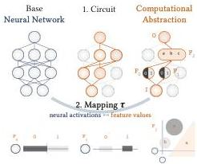

This conceptual figure illustrates the two components of any MI explanation: the *circuit* (the "where" — which subgraph of the network) and the *mapping* (the "what" — how high-level algorithm variables map to low-level neural activations). Features can be distributed across multiple neurons. This framing is crucial because it decomposes the identifiability question into four sub-questions about uniqueness of circuits, interpretations, algorithms, and subspaces.

**Figure 2 — XOR Example: Identifiability Failures**

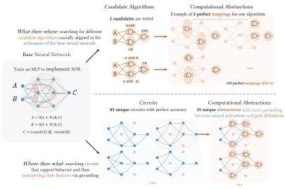

The central result. A small MLP (2 hidden layers of size 3) trained on XOR reveals catastrophic non-identifiability:

- **What-then-where (top):** Testing just 2 candidate algorithms yields 159 *perfect minimal mappings* (IIA = 1). Both algorithms are perfectly implementable, and each has multiple localizations.
- **Where-then-what (bottom):** 85 unique perfect circuits exist, with an average of 535.8 valid interpretations per circuit.

Total: 159 + 45,543 = ~45,700 incompatible computational abstractions for a single XOR MLP. There is no principled way to choose among them under current MI criteria.

**Figure 3 — Scaling with Architecture Size and Task Complexity**

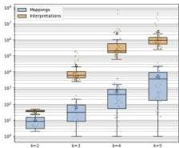

Left panel: As network width k increases from 2 to 5, the number of valid explanations explodes. Median computational abstractions grow from 38 to 910,000 (circuit-first) and from 8 to 3,700 (algorithm-first). Less than 2% of networks have exactly one valid minimal mapping; *no network* has exactly one circuit interpretation.

Right panel: Training on multiple gates in parallel (multi-task) initially reduces explanations (up to 4 tasks), but the effect plateaus beyond that.

**Figure 4 — Training Dynamics and Loss Cutoff**

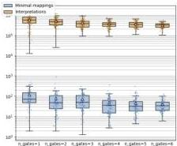

The authors test whether near-perfect training (lower loss cutoff) reduces identifiability issues. While stricter training does modestly reduce the number of abstractions, the effect is insufficient to restore identifiability. Even well-trained networks harbor many incompatible explanations.

**Figure 5 — Larger Model (MNIST Subset)**

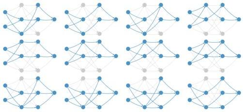

On a larger MLP (784-128-128-3-3-3-1) trained on MNIST 0/1 classification, the authors extract the final layers and find 3,209 valid circuits in the smaller sub-network alone. This demonstrates the problem persists at scale: if valid circuits exist in the first half, the full network has ≥3,209 valid circuits.

### Takeaway

This paper is a methodological gut-check for the entire MI field. The authors are not claiming MI is impossible — they are showing that *current criteria* (circuit error, IIA, mapping consistency) do not uniquely determine explanations. The 45,000+ valid explanations for XOR is not a corner case; it's a proof that unicity cannot be assumed.

The discussion offers two paths forward:
1. **Pragmatic stance:** Abandon unicity; require explanations only meet predictive/manipulability standards
2. **Stricter criteria:** Draw from causal abstraction (Beckers & Halpern) or multi-criterion validation (Vilas et al.'s "inner interpretability framework")

For Raghavendra: This directly impacts any interpretability work you do. If you're running circuit analyses or DAS experiments, you should assume your explanation is one of many — and ask what additional criteria would discriminate among them.

---

## Paper 2: Transcoders Find Interpretable LLM Feature Circuits

**Authors:** Jacob Dunefsky, Philippe Chlenski, Neel Nanda  
**Venue:** NeurIPS 2024  
**Link:** https://arxiv.org/abs/2406.11944

### Abstract

> A key goal in mechanistic interpretability is circuit analysis: finding sparse subgraphs of models corresponding to specific behaviors or capabilities. However, MLP sublayers make fine-grained circuit analysis on transformer-based language models difficult. In particular, interpretable features—such as those found by sparse autoencoders (SAEs)—are typically linear combinations of extremely many neurons, each with its own nonlinearity to account for. Circuit analysis in this setting thus either yields intractably large circuits or fails to disentangle local and global behavior. To address this we explore transcoders, which seek to faithfully approximate a densely activating MLP layer with a wider, sparsely-activating MLP layer. We introduce a novel method for using transcoders to perform weights-based circuit analysis through MLP sublayers. The resulting circuits neatly factorize into input-dependent and input-invariant terms. We then successfully train transcoders on language models with 120M, 410M, and 1.4B parameters, and find them to perform at least on par with SAEs in terms of sparsity, faithfulness, and human-interpretability. Finally, we apply transcoders to reverse-engineer unknown circuits in the model, and we obtain novel insights regarding the "greater-than circuit" in GPT2-small.

### Main Contribution

**Transcoders** are wide, sparsely-activating MLP approximations of original MLP sublayers. Unlike SAEs (which reconstruct activations), transcoders imitate the MLP's *input-output behavior*. This enables a critical property: **input-invariant feature-level circuit analysis through MLPs**.

The key architectural difference:
- SAEs: autoencoder → reconstructs the input activation
- Transcoders: ReLU MLP → approximates the MLP's output

Loss: faithfulness (MSE to MLP output) + L1 sparsity penalty on hidden activations.

### Key Results (Figure by Figure)

**Figure 1 — SAEs vs. Transcoders vs. MLP Sublayers**

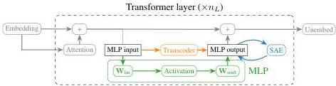

Conceptual comparison. SAEs learn to reconstruct model activations; transcoders imitate sublayer input-output behavior. This difference is crucial: because transcoders model the *function* of the MLP rather than the *state* at a point, they allow attributions that decompose into input-dependent and input-invariant parts.

**Figure 2 — Circuit-Finding Algorithm Visualization**

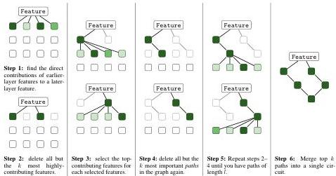

The circuit-finding method: greedily trace back from a target transcoder feature to earlier features via the input-invariant weight connections (decoder-encoder dot products). This yields computational paths that can be combined into a subgraph with attributions for each edge.

**Figure 3 — Sparsity-Accuracy Tradeoff**

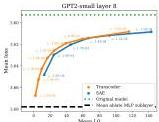

Transcoders (red/orange) vs. SAEs (blue) on GPT2-small, Pythia-410M, and Pythia-1.4B. Each point is a model trained with different L1 regularization λ₁. Transcoders match or exceed SAEs on the sparsity-faithfulness Pareto frontier. The gap widens on larger models.

**Figure 4 — Feature Interpretability (Blind Comparison)**

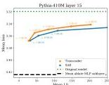

Human blind evaluation of 50 random features each from Pythia-410M layer 15 transcoder and SAE. Results (Table 1): Transcoder — 41 interpretable, 8 maybe, 1 uninterpretable. SAE — 38 interpretable, 8 maybe, 4 uninterpretable. Transcoders are at least as interpretable as SAEs.

**Figure 5 — Blind Case Study: Reverse-Engineering a Feature**

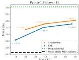

The authors demonstrate "blind" circuit analysis on GPT2-small layer 8 feature 355 (without looking at the tokens). Through de-embeddings and input-invariant connections, they reconstruct that the feature fires on semicolons in parenthetical citations like "(Vaswani et al. 2017; Elhage et al. 2021)". The circuit reveals contributions from semicolon features, year features, and surname features (Polish/English).

**Figure 6 — Greater-Than Circuit Analysis**

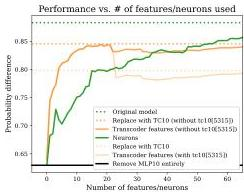

Novel findings on GPT2-small's "greater-than" circuit (previously studied by Hanna et al.). Transcoder analysis reveals:
- The circuit decomposes cleanly into magnitude-comparison features and token-position features
- Some features encode specific numeric ranges (e.g., "years in the 1900s")
- The MLP sublayer plays a more structured role than previously understood

**Figures 7–9** show additional case studies on European surnames, numeric comparisons, and date formatting, all demonstrating that transcoder features and their circuits are human-interpretable and reveal structure not apparent from SAE analysis alone.

**Figure 10 — De-embedding Analysis**

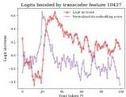

De-embedding vectors (W_E^T · f_enc) show which vocabulary tokens directly contribute to a feature's activation. For a layer 0 feature, top tokens were Polish surname endings (og1u, owsky, zyk, chenko, kowski) — revealing the feature's general behavior without examining any specific input.

**Figure 11 — Full Circuit Visualization**

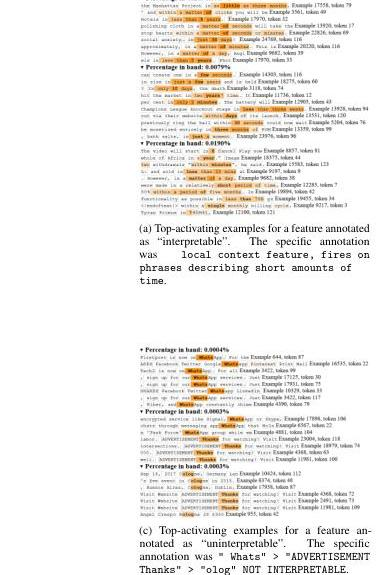

A complete computational subgraph for a feature, showing attention-head-mediated paths and direct MLP paths with attributed edge weights. The clean factorization into input-dependent (activation strength) and input-invariant (weight dot product) terms makes this visualization possible.

### Takeaway

Transcoders solve a genuine methodological pain point in MI: SAEs can't tell you the *general* input-output behavior of an MLP because attributions through MLP nonlinearities are input-dependent. Transcoders factorize this into a static weight term and a dynamic activation term, enabling input-invariant circuit analysis.

The empirical results are strong: transcoders match SAEs on interpretability and sparsity while enabling new circuit analysis capabilities. The blind case studies are particularly compelling — they show you can reverse-engineer features without confirmation bias from looking at examples first.

For Raghavendra: If you're doing circuit analysis on transformers, transcoders are a tool you should consider. The code is available at https://github.com/jacobdunefsky/transcoder_circuits/.

---

## Paper 3: The Cognitive Revolution in Interpretability: From Explaining Behavior to Interpreting Representations and Algorithms

**Authors:** Adam Davies, Ashkan Khakzar  
**Venue:** arXiv 2408.05859  
**Link:** https://arxiv.org/abs/2408.05859

### Abstract

> Artificial neural networks have long been understood as "black boxes": though we know their computation graphs and learned parameters, the knowledge encoded by these weights and functions they perform are not inherently interpretable. As such, from the early days of deep learning, there have been efforts to explain these models' behavior and understand them internally; and recently, mechanistic interpretability (MI) has emerged as a distinct research area studying the features and implicit algorithms learned by foundation models such as large language models. In this work, we aim to ground MI in the context of cognitive science, which has long struggled with analogous questions in studying and explaining the behavior of "black box" intelligent systems like the human brain. We leverage several important ideas and developments in the history of cognitive science to disentangle divergent objectives in MI and indicate a clear path forward. First, we argue that current methods are ripe to facilitate a transition in deep learning interpretation echoing the "cognitive revolution" in 20th-century psychology that shifted the study of human psychology from pure behaviorism toward mental representations and processing. Second, we propose a taxonomy mirroring key parallels in computational neuroscience to describe two broad categories of MI research, semantic interpretation (what latent representations are learned and used) and algorithmic interpretation (what operations are performed over representations) to elucidate their divergent goals and objects of study. Finally, we elaborate the parallels and distinctions between various approaches in both categories, analyze the respective strengths and weaknesses of representative works, clarify underlying assumptions, outline key challenges, and discuss the possibility of unifying these modes of interpretation under a common framework.

### Main Contribution

This is a **position/survey paper** that frames MI through the lens of cognitive science history. The central analogy: just as psychology transitioned from behaviorism (stimulus-response) to cognitive science (mental representations and algorithms), deep learning interpretation is undergoing an analogous "cognitive revolution" from post-hoc behavioral explanations to mechanistic understanding of internal representations and algorithms.

The authors propose a taxonomy:
- **Semantic interpretation:** What latent representations are learned? (probing, dictionary learning/SAEs)
- **Algorithmic interpretation:** What operations are performed over representations? (circuit discovery)

### Key Results

**Figure 1 — Historical Parallel: Behaviorism → Cognitive Revolution**

(No figure extracted from PDF)

The paper traces the historical arc:
- 1950s–60s psychology: Behaviorism (stimulus-response, no internal states) → fails on language acquisition, concept learning, working memory
- 1960s–present: Cognitive revolution → study mental representations and information processing
- Deep learning parallel: Post-hoc saliency/explanations (behaviorist) → MI studying latent features and circuits (cognitive)

**Section 3 — Semantic Interpretation Methods**

(No figure extracted from PDF)

The authors survey four approaches to semantic interpretation:

1. **Optimization/Search (Neuron-level):** Find inputs that maximally activate neurons. Challenge: polysemanticity means single neurons encode multiple concepts.

2. **Structural Probing:** Train auxiliary classifiers to predict properties from embeddings. Challenge: correlation ≠ causation; probe expressivity tradeoffs; Rashomon effect (multiple properties with equal causal efficacy).

3. **Causal Probing:** Intervene on representations and measure behavioral impact. Challenge: completeness vs. selectivity tradeoff — powerful interventions may cause collateral damage to non-target properties.

4. **Dictionary Learning (SAEs):** Unsupervised decomposition into sparse features. Challenge: features must be retroactively interpreted; superposition hypothesis; evaluating interpretations at scale requires automation.

**Section 4 — Algorithmic Interpretation Methods**

(No figure extracted from PDF)

Survey of circuit discovery approaches:

1. **Knockouts:** Zero/mean ablation to measure circuit contribution.
2. **Patching:** Replace activations from source sequence into target sequence.

Challenges:
- **Circuit architecture:** Choice of atomic subgraph level (neurons vs. attention heads) determines what's discoverable
- **One-to-one mapping assumption:** Polysemanticity undermines the assumption that subgraphs perform single operations
- **Pre-specification:** All circuits found in real LLMs so far required pre-specifying the algorithm — no true bottom-up discovery at scale
- **Rashomon effect:** Multiple distinct circuits can describe the same behavior; Zhong et al. found models may implement multiple algorithms simultaneously

**Section 5 — Toward Unified Interpretation**

(No figure extracted from PDF)

The authors argue semantic and algorithmic interpretation are complementary:
- Semantic interpretation tells you *what* the model represents
- Algorithmic interpretation tells you *how* it operates on those representations
- Together, they correspond to Marr's "level of representations and algorithms"

They note current work already combines both: causal probing + dictionary learning, circuit discovery + feature interpretation.

### Takeaway

This paper provides valuable conceptual scaffolding for the MI field. The behaviorism→cognitive revolution analogy is apt and useful. The taxonomy (semantic vs. algorithmic) clarifies that these are genuinely different research programs with different assumptions and challenges.

Most important insight: The two modes are complementary, not competing. A full understanding of a model requires both knowing what it represents (semantic) and how it processes those representations (algorithmic). This maps neatly to Marr's levels.

For Raghavendra: If you find yourself debating whether SAEs or circuits are "the right approach," this paper says the answer is "both, for different questions." The survey of assumptions and challenges in each area is also a useful checklist for evaluating new methods.

---

## Why It Matters (All Three Papers)

These three papers collectively map the current frontier of mechanistic interpretability:

1. **Méloux et al.** ask whether MI explanations are *well-defined* — and find they're not, under current criteria. This is a foundational challenge.
2. **Dunefsky et al.** provide a *practical tool* (transcoders) that expands what circuit analysis can do, particularly through MLP sublayers.
3. **Davies & Khakzar** give us the *conceptual vocabulary* to understand the field's structure and goals.

Together, they suggest MI is in a productive but precarious phase: we have powerful tools and clear conceptual frameworks, but we lack rigorous criteria for validating that any given explanation is the "right" one. The path forward likely involves multi-criterion validation (Vilas et al.), stricter causal abstraction (Beckers & Halpern), and continued tool development (transcoders, better SAEs).

For neuroscience-AI bridge work: The identifiability problem in MI has direct parallels to the multiple realizability problem in philosophy of mind and the Rashomon effect in causal inference. These aren't just technical hurdles — they're deep epistemological questions about what it means to "understand" a complex system.

---

*Digest generated on 2026-05-13 | Variant B: Detail-First*
