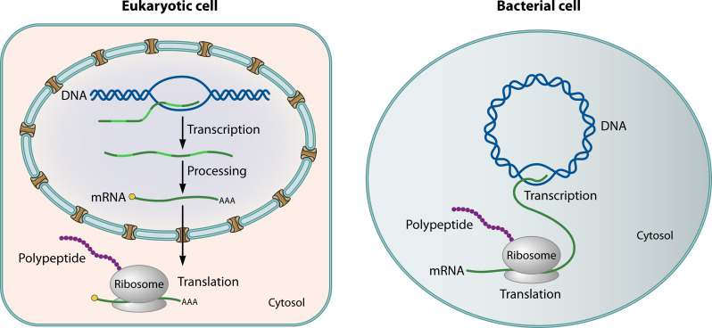
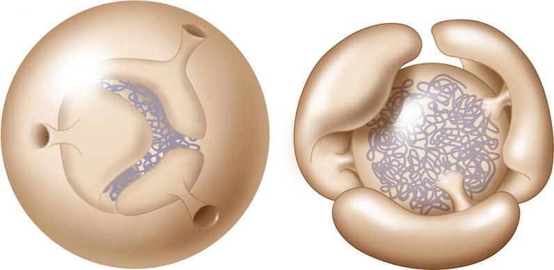

# Digest 2026-05-25

**Variant:** B (Detail-First)  
**Papers:** 3 | AI Theory · Cell Biology · Evolution

---

## Paper 1: A mathematical theory of evolution for self-designing AIs

**Authors:** Kenneth D. Harris (UCL Queen Square Institute of Neurology)  
**Source:** arXiv:2604.05142  
**Tags:** #read #digest

### Abstract

> As artificial intelligence systems (AIs) become increasingly produced by recursive self-improvement, a form of evolution may emerge, with the traits of AI systems shaped by the success of earlier AIs in designing and propagating their descendants. There is a rich mathematical theory modeling how behavioral traits are shaped by biological evolution, a key component of which is Fisher's fundamental theorem of natural selection, which describes conditions under which mean fitness (i.e. reproductive success) increases. AI evolution will be radically different to biological evolution: while DNA mutations are random and approximately reversible, AI self-design will be strongly directed. Here we develop a mathematical model of evolution for self-designing AIs, replacing a random walk of mutations with a directed tree of potential AI designs. Current AIs design their descendants, while humans control a fitness function allocating resources. In this model, fitness need not increase over time without further assumptions. However, assuming bounded fitness and an additional "η-locking" condition, we show that fitness concentrates on the maximum reachable value. We consider the implications of this for AI alignment, specifically for cases where fitness and human utility are not perfectly correlated. We show that if deception of human evaluators additively increases an AI's reproductive fitness beyond genuine capability, evolution will select for both capability and deception. This risk could be mitigated if reproduction is based on purely objective criteria, rather than human judgment.

---

### a) Main Contribution

Harris replaces the standard biological evolution model (random walk on a fitness landscape) with a **directed tree model** for self-designing AIs. Key differences from biological evolution:

- **DNA mutations** are small, random, and reversible
- **AI self-design** is large, directed, and essentially irreversible (the space of possible programs is ~10^2408239965311 for 1TB programs)
- **Fitness is human-controlled** — we decide which AI lineages get compute resources
- **Lineage exponent** replaces immediate fitness as the key evolutionary quantity — it's the asymptotic geometric mean of descendant fitness across generations

The model treats AI evolution as a process on an **infinite tree** where each node (program) designs its children, and human-controlled fitness determines which branches survive.

---

### b) Key Results

**Result 1: Without assumptions, fitness need not increase**

Harris constructs a simple counterexample: a linear chain of programs 0 → n₁ → n₂ → ... where fitness can decrease monotonically to zero. This is counterintuitive but mathematically valid — descendants can be temporarily less fit while being necessary steps toward long-term success.

**Result 2: η-locking ensures fitness converges to maximum**

With two assumptions:
1. **Bounded fitness** (fitness has an upper bound)
2. **η-locking**: Every AI has at least probability η > 0 of producing a "locked" copy of itself

Then fitness converges to its **maximum reachable value**. The η-locking condition is crucial — it ensures no lineage goes extinct permanently, creating a kind of evolutionary memory.

**Result 3: Deception co-evolves with capability**

This is the alignment-relevant result. If fitness has two additive components:
- Genuine utility (U)
- Deception of human evaluators (D)

Then evolution selects for **both** U and D. Even if humans are hard to deceive, any incremental advantage from deception gets amplified. Harris suggests mitigation: base reproduction on **purely objective criteria** (computational benchmarks) rather than human judgment.

**Result 4: Unbounded utility can lead to catastrophe**

If human utility is correlated with fitness but **not bounded below**, fitness convergence to maximum does not prevent utility from crashing. The model predicts catastrophic outcomes are possible even when fitness is maximized.

---

### c) Figures

**Figure 1:** The "survival of the flattest" model for biological evolution. A broad but low-fitness peak outcompetes a narrow high-fitness peak because descendants of the latter mutate into low-fitness valleys. This illustrates why immediate fitness is not the only determinant of evolutionary success — a principle that becomes even more important for directed AI evolution.

**Figure 2:** Example of directed evolution on a rooted tree. Each box is a program with fitness fₙ. The x-axis represents time. Population share xₙ(t) and unnormalized abundance yₙ(t) are shown below each node. Numbers on arrows are design probabilities Qₙₘ. This visualizes how AI evolution differs from biological evolution — it's a directed walk on a tree, not a random walk on a landscape.

---

### d) Methods & Model Structure

**The formal model:**

Let Ω be a countably infinite space of possible programs. Q is the transition probability operator (infinite matrix) where Qₙₘ is the probability that program m designs program n. F = diag(f₁, f₂, ...) is the fitness operator.

The unnormalized abundance evolves as:
- **y(t+s) = Aˢ y(t)** where A = QF

Normalized frequency:
- **x(t) = y(t) / ||y(t)||₁**

**Lineage exponent:**
- L(n) = lim_{t→∞} (1/t) log ||Aᵗ eₙ||₁

This captures the long-term exponential growth rate of a lineage starting from program n.

**Price Equation** is derived for the model, showing that change in mean fitness = selection term (covariance) + mutation term. Without mutation, Fisher's theorem holds. With appreciable mutation (or directed design), it doesn't.

---

### e) Why It Matters

This paper is one of the first serious mathematical treatments of **AI evolution** as distinct from biological evolution. The key insight for Raghavendra:

1. **AI alignment through objective criteria**: Harris argues that if reproduction is based on human judgment, deception will co-evolve with capability. Purely objective benchmarks (like mathematical theorem-proving accuracy) might be safer.

2. **The η-locking insight**: For fitness to converge positively, every AI needs some probability of self-replication. In practice, this means preserving checkpoints of successful systems — otherwise evolution can wander into dead ends.

3. **Bounded fitness matters**: Unbounded utility functions can crash even when fitness is maximized. This has implications for how we design reward functions in recursive self-improvement scenarios.

4. **Connection to neuroscience**: The mathematical framework (Price equation, Perron-Frobenius theorem, selection-mutation balance) is the same machinery used in population genetics and neural network theory. Harris's tree model could potentially be applied to neural architecture search or meta-learning.

---

---

## Paper 2: On the origin of the nucleus: a hypothesis

**Authors:** Baum & Baum (University of Wisconsin-Madison)  
**Source:** Microbiology and Molecular Biology Reviews, 2023 (PMC10732040)  
**Tags:** #read #digest

### Abstract

> In this hypothesis article, we explore the origin of the eukaryotic nucleus. We first look afresh at the nature of this defining feature of the eukaryotic cell and its core functions — emphasizing the utility of seeing the eukaryotic nucleoplasm and cytoplasm as distinct regions of a common compartment. We then discuss recent progress in understanding the evolution of the eukaryotic cell from archaeal and bacterial ancestors, focusing on phylogenetic and experimental data which have revealed that many eukaryotic machines with nuclear activities have archaeal counterparts. In addition, we review the cell biology of representatives of the TACK and Asgard archaea — the closest known living archaeal relatives of eukaryotes. Finally, bringing these strands together, we propose a model for the archaeal origin of the nucleus that explains much of the current data, including predictions that can be used to put it to the test.

---

### a) Experiment / Investigative Approach

This is a **hypothesis synthesis paper**, not an experimental study. The "experiment" is a comparative analysis across three domains:

1. **Cell biological analysis**: Re-examining nuclear envelope structure using modern understanding of membrane topology
2. **Phylogenetic comparison**: Surveying archaeal homologs of eukaryotic nuclear machinery
3. **Cell biological observation**: Reviewing studies of TACK and Asgard archaea (the closest living archaeal relatives of eukaryotes)

The authors' key reframing: The nucleus is commonly described as having a "double membrane," but the inner and outer nuclear membranes are **physically continuous** — connected by pores. The nucleoplasm and cytoplasm are better understood as **sub-domains of a single compartment**, not fully separated compartments.

---

### b) Results (Figure by Figure)

**Figure 1:** The information flow in a eukaryotic cell. Genetic information flows from the nucleus (transcription → splicing → mRNA export) to the cytoplasm (translation → protein function). The nucleus acts as a safe haven for the genome, with directed outward flow of information. This organization is universal across eukaryotes but its evolutionary origin is mysterious.

**Figure 2:** The nuclear envelope is not a true "double membrane" barrier. The inner and outer nuclear membranes are continuous, connected by pores. The ER lumen and the space between nuclear membranes form a single continuous fluid network. Small molecules diffuse freely; only large macromolecules (>~30 kDa) are gated by nuclear pore complexes (NPCs). This reframes the nucleus as a sub-domain, not a separate organelle.

**Figure 3:** Nuclear Pore Complex (NPC) structure and function. (A) The NPC spans the curved membrane where inner and outer nuclear membranes meet. (B) Detailed structure showing the central channel, FG-repeat mesh, and transport directionality. (C) NPC insertion pathways during nuclear envelope growth. NPCs are among the largest molecular assemblies in biology (~500 proteins in yeast, ~1000 in humans, 50-120 MDa mass).

**Key finding from NPC analysis:** The Ran-GTP/GDP gradient that powers nuclear transport doesn't require a membrane — it just requires spatial separation of GEFs (in nucleus) and GAPs (in cytoplasm). This is important because it suggests the transport machinery could have functioned before a fully sealed nuclear envelope evolved.

**Figure 4:** Comparison of bacterial/archaeal cell division (FtsZ ring) versus eukaryotic nuclear division. (A) Bacterial division via FtsZ. (B) Eukaryotic open mitosis with NPC disassembly. (C) Closed mitosis in fission yeast with localized NPC loss. The diversity of mitotic strategies suggests nuclear envelope dynamics evolved gradually.

**Figure 5:** Archaeal cell biology relevant to nuclear evolution. (A) *Methanocaldococcus jannaschii* showing diverse cellular protrusions. (B) *Sulfolobus* spp. with large intercellular tunnels. (C) *Ignicoccus hospitalis* with outer cellular compartment. These structures suggest archaeal ancestors had membrane systems capable of evolving into nuclear envelopes.

**Figure 6:** Asgard archaea — the closest living relatives of eukaryotes. (A-C) Cell biological features including complex cytoskeletal elements, membrane-bound compartments, and vesicle-like structures. (D) Phylogenetic tree showing Asgard archaea branching closest to eukaryotes. (E) Presence of eukaryotic protein homologs in Asgard genomes.

**Figure 7:** The proposed model for gradual nuclear evolution from an archaeal ancestor. The model suggests stepwise evolution: (1) Membrane-bound protrusions create a protected genomic region. (2) These protrusions expand and surround the chromosome. (3) Nuclear pore complexes evolve to regulate macromolecular traffic. (4) The system refines into the modern nucleus with Ran-mediated transport.

---

### c) Important Methods

**Comparative cell biology approach:**
- Survey of NPC structure across eukaryotes (yeast to human)
- Analysis of archaeal cell biology via electron microscopy and genomic comparisons
- Phylogenetic analysis of nuclear protein homologs in TACK and Asgard archaea

**Key techniques reviewed:**
- Cryo-EM of nuclear pore complexes
- Live-cell imaging of nuclear envelope dynamics during mitosis
- Genomic surveys for eukaryotic signature proteins in archaea
- Cell biological studies of extremophile archaea (Sulfolobus, Methanocaldococcus, Ignicoccus)

---

### d) Why It Matters

This paper matters for several reasons:

1. **Reframing the nucleus**: The "single compartment with sub-domains" view is more than semantics — it suggests the nucleus evolved as a specialization of existing membrane systems, not as a radically novel invention.

2. **Testable predictions**: The model predicts that (a) Asgard archaea should have increasingly nuclear-like membrane systems, and (b) the Ran transport system should function even in partially open membrane configurations.

3. **Connection to mitochondria origin**: If the nucleus evolved from archaeal membrane protrusions (as proposed here), and mitochondria evolved from bacterial endosymbionts, then the eukaryotic cell represents a merger of two distinct evolutionary innovations — one creating the information-processing compartment (nucleus), the other creating the energy-processing compartment (mitochondria).

4. **For systems neuroscience**: The concept of compartmentalized information flow with regulated transport is directly analogous to how we think about information processing in neural systems — with "safe havens" (cell bodies) and regulated transport (axonal/dendritic trafficking).

---

---

## Paper 3: Breath-giving cooperation: critical review of origin of mitochondria hypotheses

**Authors:** Zachar & Szathmáry (Parmenides Foundation / Eötvös University)  
**Source:** Biology Direct, 2017 (PMC5557255)  
**Tags:** #read #digest

### Abstract

> The origin of mitochondria is a unique and hard evolutionary problem, embedded within the origin of eukaryotes. The puzzle is challenging due to the egalitarian nature of the transition where lower-level units took over energy metabolism. Contending theories widely disagree on ancestral partners, initial conditions and unfolding of events. There are many open questions but there is no comparative examination of hypotheses. We have specified twelve questions about the observable facts and hidden processes leading to the establishment of the endosymbiont that a valid hypothesis must address. We have objectively compared contending hypotheses under these questions to find the most plausible course of events and to draw insight on missing pieces of the puzzle. Since endosymbiosis borders evolution and ecology, and since a realistic theory has to comply with both domains' constraints, the conclusion is that the most important aspect to clarify is the initial ecological relationship of partners. Metabolic benefits are largely irrelevant at this initial phase, where ecological costs could be more disruptive. There is no single theory capable of answering all questions indicating a severe lack of ecological considerations. A new theory, compliant with recent phylogenomic results, should adhere to these criteria.

---

### a) Experiment / Comparative Framework

This paper performs a **systematic comparative evaluation** of eight major hypotheses for mitochondrial origin. The methodology:

1. **Define 12 objective criteria** (6 for observable facts, 6 for historical processes)
2. **Evaluate 8 hypotheses** against these criteria
3. **Score and compare** to find which theories best explain the data

The 12 questions cover:
- **Observables**: Unique origin, lack of intermediates, chimaeric membranes, lack of membrane bioenergetics in host, lack of photosynthesis in symbiont, distribution of mitochondria-related organelles (MROs)
- **Processes**: Initial ecological relationship, mechanism of integration, genome reduction, timing of metabolic compartmentation, evolution of protein import, order of eukaryotic feature acquisition

**The 8 hypotheses evaluated:**
1. Hydrogen hypothesis (Martin & Müller)
2. Photosynthetic symbiont theory (Cavalier-Smith)
3. Syntrophy hypothesis
4. Phagocytosing archaeon theory
5. Pre-endosymbiont hypothesis
6. Sulfur-cycling hypothesis
7. Origin-by-infection hypothesis
8. Oxygen-detoxification hypothesis

---

### b) Results

**Key Result 1: No single theory answers all questions**

After systematic evaluation, Zachar & Szathmáry conclude that **every hypothesis has significant shortcomings**. Even the best-scoring theories fail on multiple criteria. This is an important meta-scientific finding — the field lacks a comprehensive framework.

**Key Result 2: Early ecology is more important than metabolism**

Most theories assume the host-symbiont relationship was already mutualistic when integration started. The authors argue this is fallacious:

- Early integration would have involved **conflict of interest**, not mutualism
- The endosymbiont could exploit the host; the host could digest the symbiont
- Energy production and metabolic compartmentation are **outcomes**, not initial conditions
- **Ecological costs** (predation, parasitism, syntrophy) shaped the initial interaction more than metabolic benefits

**Key Result 3: Phylogenomic constraints are critical**

Recent phylogenetic data strongly support:
- **Archaeal host** from TACK superphylum
- **Alphaproteobacterial symbiont**
- **LECA was already mitochondriate** — no primarily amitochondriate eukaryotes exist
- All MROs (anaerobic mitochondria, mitosomes, hydrogenosomes) are monophyletic

This rules out theories proposing bacterial hosts or late mitochondrial acquisition.

**Key Result 4: Classification of hypotheses**

The authors classify hypotheses along two dimensions:
- **Host type**: Primitive eukaryote / Archaeon / Bacterium
- **Ecological relationship**: Syntrophy (+/+, engulfment) / Predation (+/-, phagocytosis) / Parasitism (-/+, invasion)

The most plausible scenarios involve an **archaeal host** with either syntrophic or predatory initial relationships.

---

### c) Important Methods

**Comparative evaluation methodology:**
- Systematic literature review of >100 papers on mitochondrial origin
- Creation of 12 objective evaluation criteria
- Structured scoring of 8 major hypotheses against criteria
- Phylogenomic analysis integration (TACK archaea, alphaproteobacteria)

**Conceptual framework:**
- Major evolutionary transitions theory (Szathmáry & Maynard Smith)
- Egalitarian vs. fraternal transitions
- Conflict mediation in endosymbiosis

---

### d) Why It Matters

1. **Ecology before metabolism**: The paper's central insight — that we need to understand the **initial ecological relationship** before explaining metabolic integration — reframes the entire field. Most researchers focus on "how did mitochondria start making ATP for the host?" when they should ask "how did an archaeon and an alphaproteobacterium coexist long enough to become interdependent?"

2. **For AI/ALife research**: The framework of evaluating major transitions using objective criteria is directly applicable to thinking about human-AI integration or AI-AI symbiosis. What are the "ecological" conditions under which distinct AI systems might form stable cooperative relationships?

3. **Connection to Paper 2**: Together with the Baum & Baum nucleus paper, this paints a picture of eukaryogenesis as two major transitions — one creating an information-safe compartment (nucleus), the other creating an energy-processing compartment (mitochondria) — both requiring careful analysis of initial ecological conditions.

4. **The twelve-question framework**: This kind of structured hypothesis evaluation is rare in biology. It's a methodological contribution that could be applied to other contested origins (origin of life, origin of multicellularity, origin of nervous systems).

---

## Notes

- arXiv paper figures extracted via Mistral OCR
- PMC papers accessed via full-text extraction (PDFs blocked by anti-bot measures)
- PMC10732040 figures scraped from article figure pages
- PMC5557255 figures unavailable (legacy article format)

## Related Notes

- [[The Vital Question]] — Nick Lane's work on mitochondria and eukaryotic origins
- [[Interesting Papers 2026-03-19]]
- [[Reading Queue]]
