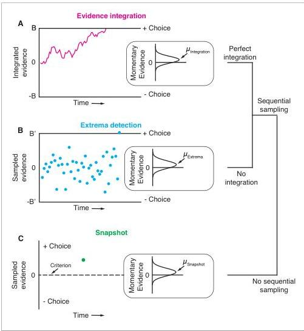
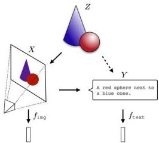
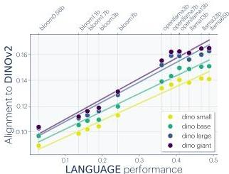

# Digest 2026-06-03

*Generated on June 3, 2026 | Variant B: Detail-First*

**Note:** No papers were found with `#unread` tags in the current notes. Selected 3 open-access research papers from untagged notes in `content/2026/` and the Reading Queue. Papers were extracted using Mistral OCR.

---

## Paper 1: Mice in a labyrinth show rapid learning, sudden insight, and efficient exploration

**Rosenberg, Zhang, Perona & Meister (2021)** *eLife*

### Abstract

> Animals learn certain complex tasks remarkably fast, sometimes after a single experience. What behavioral algorithms support this efficiency? Many contemporary studies based on two-alternative-forced-choice (2AFC) tasks observe only slow or incomplete learning. As an alternative, we study the unconstrained behavior of mice in a complex labyrinth and measure the dynamics of learning and the behaviors that enable it. A mouse in the labyrinth makes ~2000 navigation decisions per hour. The animal explores the maze, quickly discovers the location of a reward, and executes correct 10-bit choices after only 10 reward experiences — a learning rate 1000-fold higher than in 2AFC experiments. Many mice improve discontinuously from one minute to the next, suggesting moments of sudden insight about the structure of the labyrinth. The underlying search algorithm does not require a global memory of places visited and is largely explained by purely local turning rules.

### a) Experiment

The authors built a complex binary-tree labyrinth with 6 levels, 63 T-junctions, and 64 end nodes (Figure 1). A single mouse in a home cage has free access to the maze for 7 hours during its subjective night. No human training or shaping is involved — the animal acts entirely on its own. Water-deprived mice receive water only from a port hidden at one end node. All movements are recorded via infrared video from below and tracked with DeepLabCut.

**Key design features:**
- Naturalistic behavior: no trial structure, no forced choices
- ~2000 navigation decisions per hour
- Water port requires 6 correct binary choices in sequence (12 bits total for out-and-back)
- Rotation experiments test whether mice use external cues vs internal representation

### b) Results (Figure by Figure)

**Figure 1 — The maze environment.** (A) Top and (B) side views of the home cage connected to the labyrinth. (C) The maze as a binary tree with 63 branch points. One end node contains a water port. (D) A mouse at the central intersection with DeepLabCut keypoints (nose, mid-body, tail base, four feet).

**Figure 2 — Sample trajectories.** Early bouts show exploration deep into the tree. Later bouts become focused on the water port. Even late in the night, animals continue exploring other parts.

**Figure 3 — Few-shot learning of path to water.** (A) Timeline of water rewards for 10 mice. (B) Path length (in steps) from entrance to water port vs. number of rewards experienced. The error rate decays by 1/e after ~10 rewards. Right panel: histogram showing most runs eventually become perfect (length 6). Top: fraction of perfect runs increases with experience, and their duration decreases.

**Key finding:** After only ~10 reward experiences, mice learn to make 6 correct sequential decisions — a learning rate ~1000× higher than typical 2AFC tasks.

**Figure 4 — Navigation is robust to maze rotation.** After 180° rotation of the maze, 3 of 4 mice went directly to the correct water port on their first entry, *before* visiting the "image location" where rotated cues would point. This indicates navigation relies primarily on internal representation rather than external cues deposited in the maze.

**Figure 5 — Sudden changes in behavior.** (B-C) For individual mice, the rate of water rewards and long direct paths to water can jump discontinuously by factors of 2-5, suggesting moments of sudden insight rather than gradual learning. (D) Some animals show more continuous improvement.

**Figure 6 — Homing succeeds on first attempt.** (A) Most animals' first return to the exit starts from the deepest level of the maze. (B) Long home runs appear *before* short ones — opposite of gradual practice. (C-D) The home path typically has minimal overlap with the outbound path, ruling out simple path-reversal strategies.

### c) Important Methods & Highlighted Points

- **DeepLabCut tracking:** Nose, mid-body, tail base, four feet
- **Node sequence analysis:** Reduces continuous trajectory to discrete transitions through 127 nodes
- **Behavioral states:** Exploration (84-95% of time), water-directed, exit-directed
- **Local turning rules:** The search algorithm is largely explained by simple local rules (e.g., prefer unexplored corridors)

**Author's main takeaway:** Mice possess remarkably efficient exploration and learning algorithms that operate with minimal experience. The "Ariadne's thread" homing ability appears innate, and rapid learning may involve discrete insight events rather than purely gradual accumulation.

### d) Why It Matters

This paper challenges the assumption that complex laboratory learning requires extensive training. By studying naturalistic behavior in an ecologically relevant environment (burrowing rodents in tunnels), the authors reveal learning rates orders of magnitude faster than conventional tasks. For Raghavendra: this connects to questions about innate vs. learned behaviors, the nature of insight in animal cognition, and whether neural mechanisms studied in highly trained animals generalize to natural behavior. The maze rotation experiment is a particularly elegant test of internal vs. external representation.

---

## Paper 2: Differentiating between integration and non-integration strategies in perceptual decision making

**Stine, Zylberberg, Ditterich & Shadlen (2020)** *eLife*

### Abstract

> Many tasks used to study decision-making encourage subjects to integrate evidence over time. Such tasks are useful to understand how the brain operates on multiple samples of information over prolonged timescales, but only if subjects actually integrate evidence to form their decisions. We explored the behavioral observations that corroborate evidence-integration in a number of task-designs. Several commonly accepted signs of integration were also predicted by non-integration strategies. Furthermore, an integration model could fit data generated by non-integration models. We identified the features of non-integration models that allowed them to mimic integration and used these insights to design a motion discrimination task that disentangled the models. In human subjects performing the task, we falsified a non-integration strategy in each and confirmed prolonged integration in all but one subject. The findings illustrate the difficulty of identifying a decision-maker's strategy and support solutions to achieve this goal.

### a) Experiment

The authors compare three decision-making strategies in perceptual tasks:
1. **Integration (drift-diffusion):** Noisy evidence samples are accumulated until a bound is reached
2. **Extrema detection:** Samples are checked sequentially; decision made when one exceeds a threshold (no accumulation)
3. **Snapshot:** A single random sample is acquired and compared to a criterion (no sequential sampling or integration)

They simulate all three models in fixed-duration, variable-duration, and free-response task designs, then test predictions in a human random-dot-motion discrimination task with both free-response and variable-duration blocks.

### b) Results (Figure by Figure)

**Figure 1 — Three general decision-making models.** (A) Integration: evidence accumulates until a bound is crossed. (B) Extrema detection: sequential samples are checked against thresholds; non-extreme samples are forgotten. (C) Snapshot: a single random sample determines the choice.

**Figure 2 — Non-integration mimics integration in fixed-duration tasks.** All three models produce sigmoidal psychometric curves and flat psychophysical kernels. The kernel flatness is commonly taken as evidence for integration, but extrema detection and snapshot can match it through different mechanisms (guessing on failed trials + flexible parameter fitting).

**Figure 3 — Mimicry in variable-duration tasks.** Both extrema detection and snapshot show improved sensitivity with longer stimulus durations — not because they average noise, but because longer durations reduce the probability of "guess trials" (when no extremum/snapshot occurs before stimulus offset). An integration model can misleadingly fit extrema detection data well.

**Figure 4 — Similarity in free-response tasks.** Extrema detection also predicts longer RTs for weaker stimuli. Integration and extrema detection produce similar RT distributions because convolution with non-decision time obscures the difference between exponential (extrema) and Gaussian (integration) decision times. However, extrema detection requires implausibly long non-decision times (50-150 ms longer).

**Figure 5 — Task design that disentangles models.** The critical insight: constrain the non-decision time (via speeded 100% coherence trials) and constrain κ (SNR parameter) to be shared across free-response and variable-duration blocks. With these constraints, only the true data-generating model can simultaneously fit both trial types.

**Figure 6 — Human subject data.** (A) Free-response RTs and choice proportions for 6 subjects. With non-decision time constrained, extrema detection fails for all subjects. Integration fits well for subjects 1-3 but struggles for 4-6. (B) Variable-duration sensitivity. With κ constrained from FR fits, integration successfully predicts VSD data for subjects 1-3 and 5.

**Figure 7 — Leaky integration estimates.** Fitting a leaky integration model (intermediate between perfect integration and extrema detection) reveals: subjects 2-3 have effectively infinite time constants (perfect integration); subjects 4-5 have ~0.8 s time constants (moderate leak); subject 6 shows evidence for substantial leak.

### c) Important Methods & Highlighted Points

- **Model parameterization:** Three models are nested conceptually, differing only in integration time constant (∞, 0, or intermediate)
- **Key constraints:** Shared κ across FR and VSD blocks; empirically measured non-decision time from speeded trials
- **Model comparison:** ΔBIC strongly favors integration over extrema detection when RT distributions are fit fully
- **Subject variability:** Not all subjects show perfect integration; some exhibit leaky integration with ~1s time constants

**Author's main takeaway:** Many accepted behavioral signatures of evidence integration (flat kernels, accuracy-duration tradeoffs, speed-accuracy tradeoffs) are *necessary but not sufficient* evidence for integration. Only by cross-constraining parameters across multiple task designs can strategies be disentangled.

### d) Why It Matters

This is a methodological wake-up call for decision neuroscience. The finding that non-integration models can mimic integration in standard tasks means that many studies may have misidentified their subjects' strategies. For Raghavendra: the paper provides a clear framework for rigorously testing whether subjects integrate evidence, with direct implications for interpreting neural data from perceptual decision tasks. The leaky integration model offers a more nuanced continuum between perfect integration and snapshot decisions.

---

## Paper 3: The Platonic Representation Hypothesis

**Huh, Cheung, Wang & Isola (2024)** *ICML*

### Abstract

> We argue that representations in AI models, particularly deep networks, are converging. First, we survey many examples of convergence in the literature: over time and across multiple domains, the ways by which different neural networks represent data are becoming more aligned. Next, we demonstrate convergence across data modalities: as vision models and language models get larger, they measure distance between datapoints in a more and more alike way. We hypothesize that this convergence is driving toward a shared statistical model of reality, akin to Plato's concept of an ideal reality. We term such a representation the platonic representation and discuss several possible selective pressures toward it. Finally, we discuss the implications of these trends, their limitations, and counterexamples to our analysis.

### a) Main Contribution

The paper formalizes the **Platonic Representation Hypothesis**: different neural networks, trained with different objectives on different data and even different modalities, are converging toward a shared representation of reality. They call this converged representation the "platonic representation" — a statistical model of the underlying reality that generates our observations.

**Three mechanisms driving convergence:**
1. **Multitask Scaling Hypothesis:** More tasks → fewer compatible representations → convergence
2. **Capacity Hypothesis:** Larger models cover more of function space → more likely to find the global optimum
3. **Simplicity Bias Hypothesis:** Deep networks implicitly prefer simple solutions → larger models have stronger bias toward the same simple solution

### b) Key Results (Figure by Figure)

**Figure 1 — The Platonic Representation Hypothesis.** Images (X) and text (Y) are projections of a common underlying reality (Z). Representation learning algorithms converge on a shared representation of Z as scale increases.

**Figure 2 — Vision models converge as competence increases.** Left: Models solving more VTAB tasks are more aligned with each other (mutual nearest-neighbors on Places-365). Right: UMAP embedding of models by representational distance. Competent models cluster together; weak models are scattered.

**Figure 3 — Language and vision models align.** Better language models (measured by bits-per-byte on OpenWebText) align better with vision models (mutual nearest-neighbors on Wikipedia image-caption pairs). CLIP models show highest alignment. Interestingly, fine-tuning CLIP on ImageNet *reduces* alignment.

**Figure 4 — Alignment predicts downstream performance.** LLMs that align more closely with vision models (DINOv2) perform better on commonsense reasoning (Hellaswag) and math (GSM8K). Suggests cross-modal alignment is not just correlation but may reflect genuine representational quality.

**Figure 5 — Capacity hypothesis.** If an optimal representation exists, larger hypothesis spaces are more likely to cover it. Two small models may find different local optima; large models can reach the same global optimum.

**Figure 6 — Multitask scaling.** More tasks impose more constraints, shrinking the solution space. Contrastive learning, masked autoencoding, and autoregressive language modeling all implicitly optimize many tasks simultaneously.

**Figure 7 — Simplicity bias.** Larger models have more ways to fit the same data, but deep networks' implicit preference for simple solutions pushes them toward the same simple fit.

**Figure 8 — Color cooccurrence.** Color representations learned from image cooccurrence (CIFAR-10), language cooccurrence, and human perception (CIELAB) are remarkably similar, suggesting convergent structure from different modalities.

**Theoretical result:** For contrastive learners with NCE objectives, the learned kernel converges to the Pointwise Mutual Information (PMI) kernel of the underlying data distribution. Since PMI is modality-independent (for bijective observations), different modalities converge to the same representation.

### c) Important Methods & Highlighted Points

- **Alignment metric:** Mutual nearest-neighbor overlap (variant of Klabunde et al. 2023)
- **78 vision models** compared across architectures, objectives, and datasets
- **Cross-modal alignment:** Wikipedia image-caption pairs bridge vision and language
- **PMI kernel:** ⟨f(xᵢ), f(xⱼ)⟩ ≈ log P(xᵢ, xⱼ) / [P(xᵢ)P(xⱼ)] + constant

**Author's main takeaway:** Scale is sufficient (but not necessarily efficient) for convergence. If the hypothesis holds, training data can be shared across modalities — the best vision model should also train on text, and vice versa. This offers a theoretical grounding for why multimodal training improves unimodal performance.

### d) Takeaway

This paper provides a philosophical and mathematical framework for one of the most striking empirical observations in modern ML: models are becoming more alike as they get better. The "platonic representation" concept connects to Plato's cave, scientific realism, and the Anna Karenina principle (all good models are alike; each bad model is bad in its own way). For Raghavendra: the neuroscience connection is explicit — the authors note that neural networks also align with biological representations (Yamins et al. 2014), suggesting that brains and machines face similar representational constraints. The PMI analysis offers a concrete mathematical handle on what "convergence" means mechanistically.

---

## Notes

- **Papers selected from:** Reading Queue (unread research papers without #unread tags)
- **Variant:** B (Detail-First)
- **Mistral OCR** used for PDF extraction
- **Images saved to:** `content/images/digest/2026-06-03/`

## Papers Needing #unread Tags

If you'd like the digest system to automatically find papers, consider adding `#unread` tags to research paper notes in `content/2026/` or `content/2024/`.
