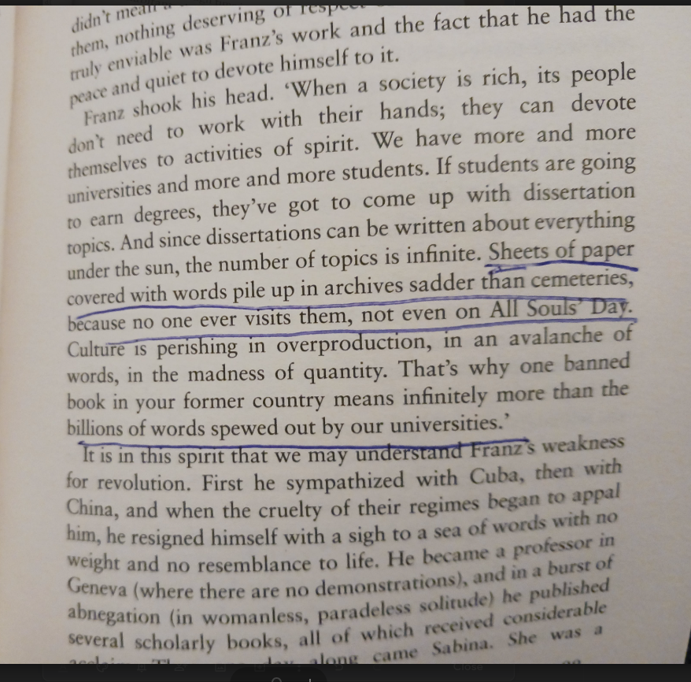
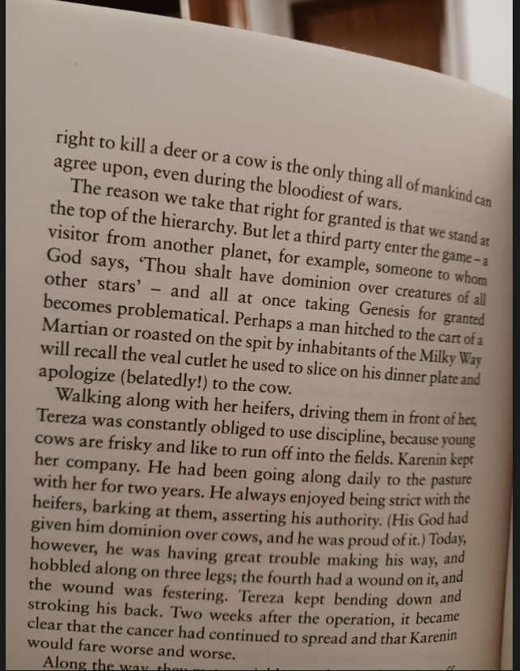
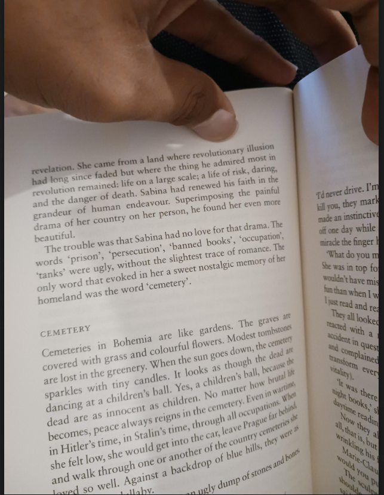

# The Unbearable Lightness of Being

Imported from Google Keep on 2026-03-23.

## Reading notes

Sabina feels both guilty and exhilarated because betrayal, for her, is the deepest form of freedom. It keeps her from being trapped in roles or collectives, but it also isolates her and condemns her to loneliness.

Sabina likes a peaceful life becauss she has seen the hardships in her country.
Franz likes risk and danger becauze he has not seen it.  Franz is not a risk taking person. He just admires what he can't see like people admiring action spy movies.

Words misunderstood: when u grow together u develop similar concepts and share motifs. But u meet matured, ur developed concepts may differ. "Musical composition of life had scarecelt been outlined"

Psychoanalysis od teresa's dream

We don't really know what we are prusuing. Sabina was pursuing lightness by doing betrayls after betrayals. But once she reached end of it, she is in melancholy.

The parallels  between political situation: provates being lesked and personal situation: diary being read.

## Imported images from Keep

