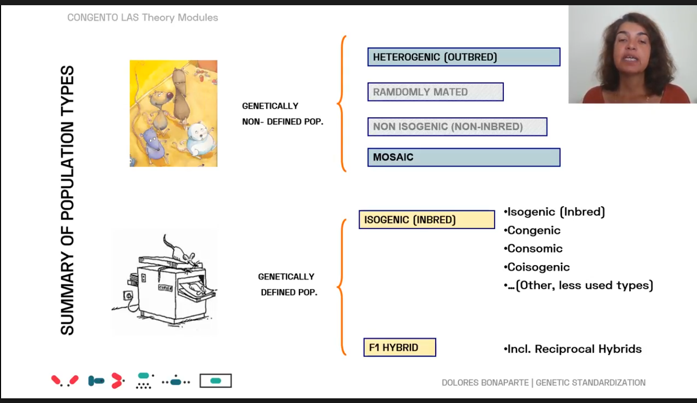

# Practical
1 - how to handle and restrain the animal
2 - identification tags + get genetic samples
3 - how to collect urine, feces, blood from rodents
4 - how to administer/injections - intrapeterenoial, subcutaneous, intravenous, euthanasia

## C1 - 3
- Replace, Reduce, Refine
-
## C4 - humane end pt
Humane endpt - sacrifice/end suffering because animal has suffered too much.
Severity classification 
- non recovery - anasthesia. 
- mild - mild pain
- moderate -  long time. Ex- anesthetized surgery.
- severe - lethal  dose
## C5 - clinical eval
know normal behaviour, posture, apperance
## C6 - harm benefit evals

## C7 - genetic
Locus: - place on chromosome where gene lies
alleles - variation of gene that occupy the same locus
homozygus - from each parent , same allele
hetrozygus, from each parent , different allele

 knockouts of same gene in different genetic speicies have different effects ?

Inbred/isogenic/consanguineous:
- all animals are homozygus for all loci
- inter crossing bro/sis??? 
- Intercross = bro and sis mate/ same strain

F1 - first generation, F2 - secoend gen("F" for intercrossing)

genetic drift - mutation in one ... .after many  generations .. all genes different

back-crossing: hybird mate with strain "A", then offspring further with strain "A" (Ni for animal of i th generation)

Substrains:
divide inbred into groups
congenic:
include a single gene via backcrossing
consomic:
include a full chromosome via backgrossing
co-isogenic:
genetically identical except for single locus?

Genetically - non defined population
Outbred:
Bottleneck: some genetic couldn't make it through neck of bottle when choosen

## C8 - genetically altered models
Genetic methods and all

## C9 - working with geneticaly altered animals
u don't know welfare state of animals after modifying geneticaly
## c10 - microbio management
cross-contatmination is bad for health of huams and animals
random sampling calc
## c11 - health,safety,
group 1,2,3,4 waste types

## c12 - feeding

## c13 - administraion and sampling
parenteral - through blood stream, not digestive
enteral - go via liver, digestive system
immersion - fish, water
topical - where action is needed

high gauge - thin neeedle

subcutaneous
intramuscular
intraperetonial - in abdomonial cavity
intravenous - in veins
retro-orbital : near eye
neonatals > 26G, not more than 20 mu L

## c14 - euthanasia

## c15 - public outreach
EARA - euro animal research association

# Rodent
## r1 - rodent bio
5 freedoms

## r2 - behaviour and welfare
stereotypies - abnormal behaviours like backflip, circling, jumping

##  r3 - facilities
hummidty - btn 35 and 80

## r4 - housing
static cages - only ventilation
ventilated - supply of air
special housing for behaviour exp
groups of 3
once a week

## r5 - husbandry
changing home is stressful for 30-60mins
dont do experiment on that day
replace water, not refill

nude mice, arthritic mice needing softer bedding
diabetic models  - need to clean regularly due to frequent urination

## r6 - feeding and nutrition

## r7 - reporoduction
anogenital distance in male = 2x female
lee boot effect - esterous is supress bcoz female is alone. pseudo stimulation of vagina by cotton swab can help
whitten effect - synchronize esterus of females by introducing a male. in mouse, not rats
bruce effect -  in mice, preganant female when smells odour of some other male, gets aborted
vandenberg effect - exposure to male, fastens esterus cycle

copulatory plug - male should not prengante already pregant female

##  r8 - colony management
postpartum estrus - after delivery, become pregnant again

## r9 - transport

## r10 -recognition of pain
Body condition score : 1 - 5. 3 is good.run hand over spine

Grimace Scale - params 1 to 3

## r11  - disease management
common signs of diease./ organ specific
comon default conditions - like low urine in c57
hydrocephalus - dome shaped head

