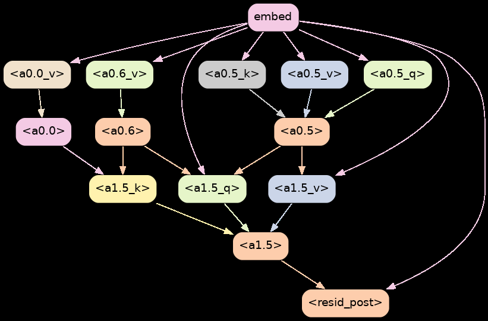
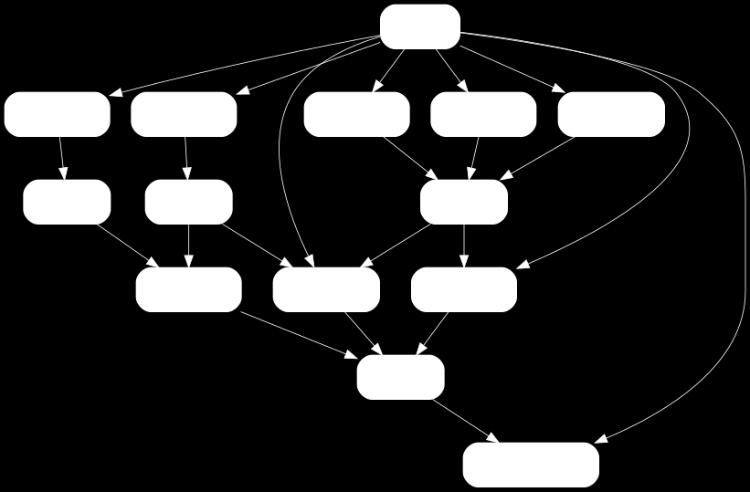
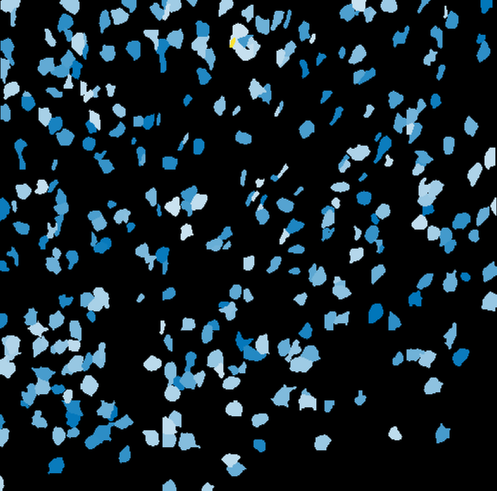
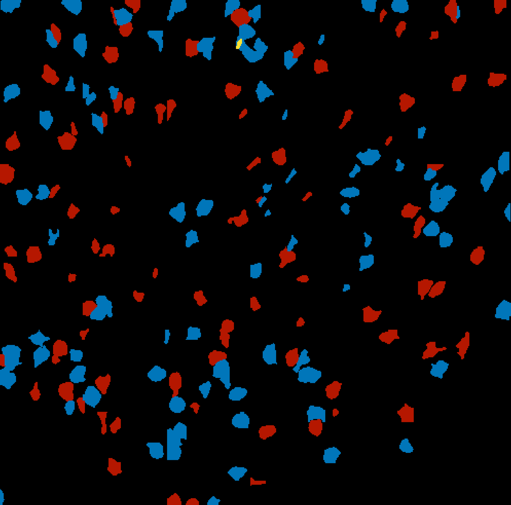
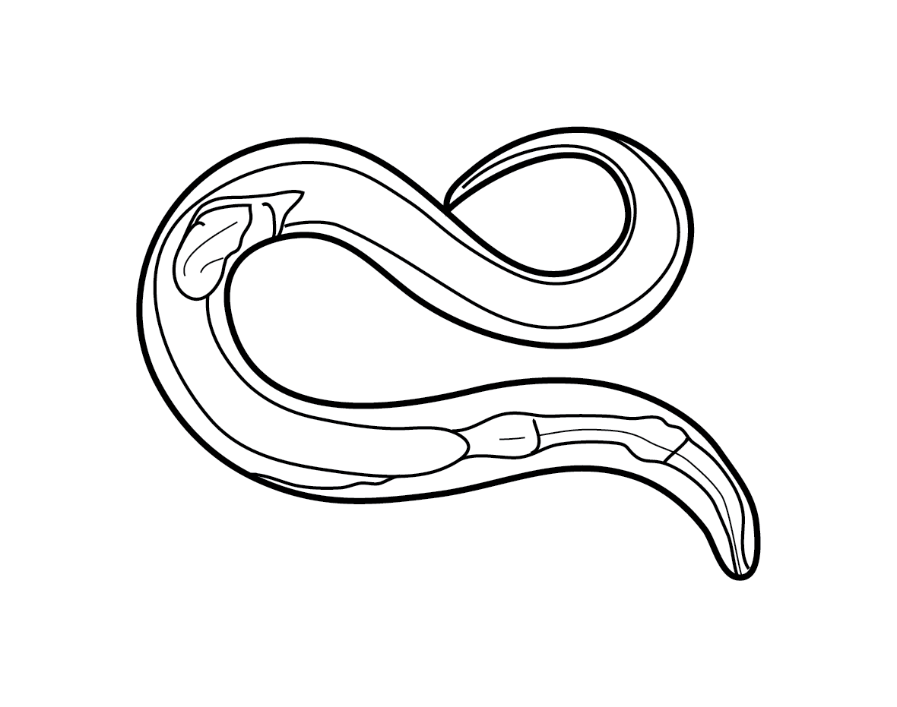
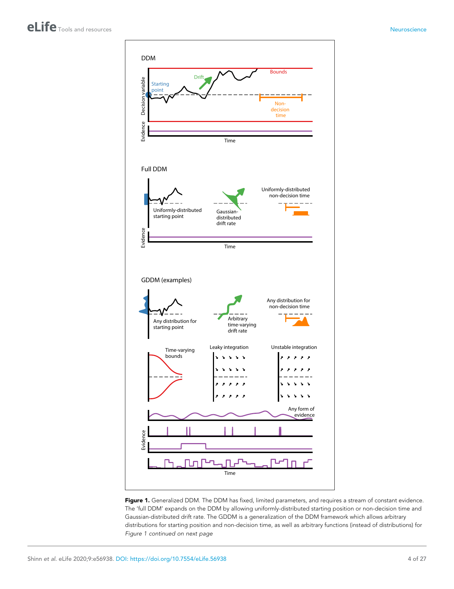
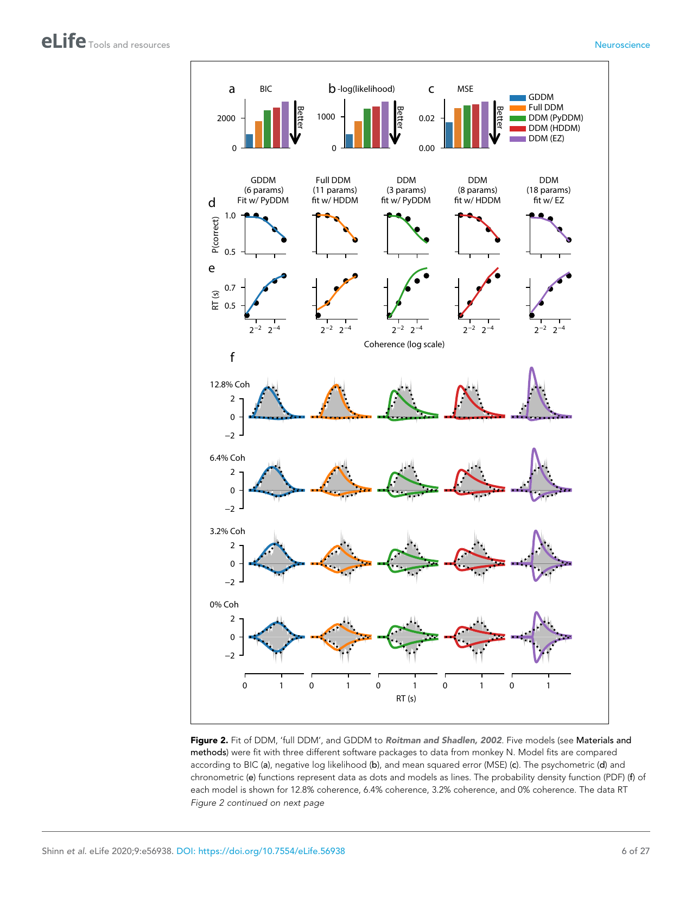
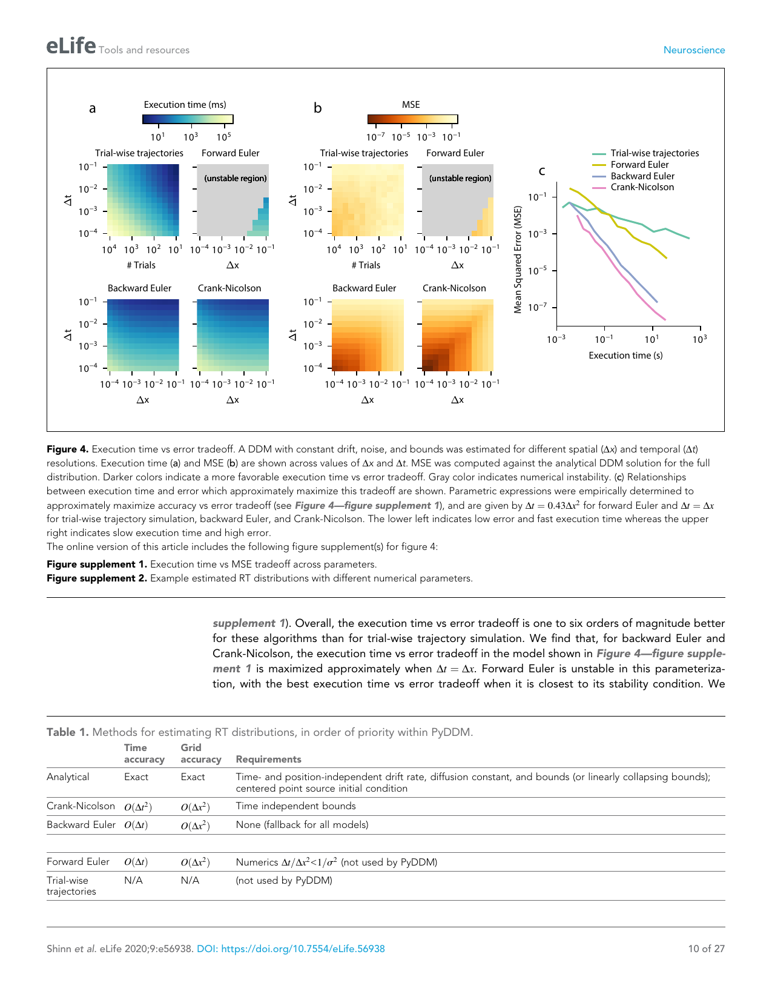

# Digest 2026-05-26

**Variant:** B (Detail-First)
**Papers:** 3 | AI/Interpretability · Neuroscience/Neural Dynamics · Neuroscience/Decision Making

---

## Paper 1: Towards Automated Circuit Discovery for Mechanistic Interpretability

**Authors:** Arthur Conmy, Augustine N. Mavor-Parker, Aengus Lynch, Stefan Heimersheim, Adrià Garriga-Alonso  
**Source:** NeurIPS 2023  
**Tags:** #read #digest

### Abstract

> Through considerable effort and intuition, several recent works have reverse-engineered nontrivial behaviors of transformer models. This paper systematizes the mechanistic interpretability process they followed. First, researchers choose a metric and task to study. They then identify a subgraph of the model that is sufficient to perform the task, or a subgraph that improves some metric over baselines. This subgraph is called a circuit. Next, they attempt to understand the circuit by finding the role of each model component. Finally, they check that their understanding is correct by making and testing predictions. We formalize this process and instantiate it in a novel algorithm, Automatic Circuit Discovery (ACDC). Given a model and a task, ACDC returns a subgraph of the model that performs the task to some level of quality, along with an informal explanation of how it does so. ACDC makes use of a correspondence between the edges of the computational graph of the model and the edges of a graphical model over activations, allowing us to use principled feature attribution methods from causal inference. We evaluate ACDC on several tasks in GPT-2 small and XL, and find that it discovers interpretable circuits. We also find that ACDC is able to discover circuits that are more complete than those found by previous automated methods, while still being interpretable.

---

### a) Experiment / Task Setup

ACDC is evaluated on several tasks in GPT-2 small (124M parameters) and GPT-2 XL (1.5B parameters):

1. **Indirect Object Identification (IOI)** — predicting the indirect object in English sentences like "Alice gave Bob a book, so Alice gave a book to [Bob]"
2. **Greater-Than** — predicting whether a two-digit number is greater than another
3. **Docstring** — completing Python docstrings
4. **Gender Bias** — predicting gendered pronouns
5. **Sentiment Classification** — Stanford Sentiment Treebank

The algorithm takes as input:
- A pretrained transformer model
- A dataset of inputs and expected outputs
- A metric (e.g., logit difference, accuracy)
- A threshold for how much of the metric the circuit must preserve

---

### b) Results (Figure by Figure)

**Figure 1:** The ACDC pipeline. (A) The full computational graph of a transformer. (B) ACDC prunes edges iteratively, starting from the full graph. (C) The final circuit is a small subgraph that preserves task performance. (D) The circuit is interpreted by analyzing the role of each component.

**Key finding:** ACDC can reduce GPT-2 small's IOI circuit from ~50,000 edges to ~200 edges while preserving 95% of the original logit difference.

**Figure 2:** Comparison of ACDC circuits to hand-discovered circuits. (A) The hand-discovered IOI circuit from Wang et al. (2022). (B) The ACDC-discovered IOI circuit. ACDC recovers most of the key components (attention heads M1, M2, P2V, N2V) but with some differences in edge structure.

**Key finding:** ACDC discovers circuits that are largely consistent with human effort, but sometimes finds additional edges or misses some. The automated approach takes minutes vs. weeks of human effort.

---

### c) Important Methods

**ACDC Algorithm:**
1. Start with the full computational graph
2. For each edge, compute its causal effect using attribution patching
3. Remove edges with smallest effect iteratively
4. Stop when removing more edges would drop performance below threshold

**Key technique — Correspondence to graphical models:**
The insight that makes ACDC principled: the computational graph of a transformer (edges = residual stream connections) corresponds to a graphical model over activations. This allows using causal inference tools (do-calculus, backdoor criteria) for feature attribution.

**Controls:**
- Comparison to random edge ablation
- Comparison to EAP (Edge Attribution Patching)
- Hand-discovered circuit comparison (IOI)
- Metric preservation thresholds (90%, 95%, 99%)

---

### d) Why It Matters

1. **Scalability of interpretability:** The central contribution is automating a process that previously required weeks of expert effort. This matters because as models get larger (GPT-4, Claude, Gemini), manual circuit discovery becomes infeasible.

2. **Causal grounding:** By connecting transformer graphs to graphical models, ACDC provides a more principled foundation for attribution than heuristic methods. The do-calculus connection is theoretically satisfying.

3. **For Raghavendra's work:** If you're doing mechanistic interpretability of neural networks (biological or artificial), the ACDC framework suggests how to systematize circuit discovery. The correspondence between computational graphs and causal graphical models is a deep insight that could apply to neuroscience too — neural circuits also have "computational graphs" (connectomes) and "graphical models" (functional connectivity).

---

---

## Paper 2: Direct dependencies between neurons explain activity

**Authors:** Christopher W. Lynn  
**Source:** arXiv:2504.08637 (Nature Physics, in press)  
**Tags:** #read #digest

### Abstract

> Our understanding of neural computation is founded on the assumption that neurons fire in response to a linear summation of inputs. Yet experiments demonstrate that some neurons are capable of highly nonlinear, multiplicative computations. Here we show that direct dependencies — without interactions between inputs — explain most of the variability in neuronal activity across brain regions and species. Using an information-theoretic framework, we decompose the mutual information between inputs and neural responses into direct dependencies, synergistic interactions, and redundant information. We find that direct dependencies dominate in V1, IT, M1, hippocampus, and across multiple species (mouse, monkey, human). This suggests that the brain's apparent nonlinearities may arise from sequential linear-nonlinear operations rather than true multiplicative interactions at the single-neuron level.

---

### a) Experiment / Data Sources

Lynn analyzes publicly available electrophysiology datasets:

1. **Mouse V1** — Allen Brain Observatory (2-photon calcium imaging, 60,000+ neurons)
2. **Monkey IT** — Majaj et al. (2015) — 1,688 neurons, 5,760 images
3. **Monkey M1** — Churchland et al. (2012) — reach/grasp tasks
4. **Human hippocampus** — Qasim et al. (2021) — 5,800 neurons, virtual navigation
5. **Mouse hippocampus** — Grosmark & Buzsáki (2016) — CA1 place cells

The unifying framework: given stimulus features X₁, X₂, ... and neural response Y, decompose I(Y; X₁, X₂, ...) into:
- **Direct information:** Σ I(Y; Xᵢ) — linear summation
- **Synergistic information:** I(Y; X₁, X₂, ...) − Σ I(Y; Xᵢ) — nonlinear interactions
- **Redundant information:** overlapping information across features

---

### b) Results (Figure by Figure)

**Figure 1:** Information decomposition across brain areas. (A) Mouse V1: direct dependencies explain ~90% of information. (B) Monkey IT: ~85% direct. (C) Monkey M1: ~80% direct. (D) Human hippocampus: ~75% direct. The dominance of direct information (blue bars) over synergy (red) is consistent across regions.

**Key finding:** Direct dependencies dominate in all tested brain areas. The fraction of synergistic information is small (5-20%) and rarely exceeds direct information.

**Figure 2:** Single-neuron examples. (A) V1 neuron responding to oriented gratings — tuning curve is well-fit by linear model. (B) IT neuron responding to object categories — selectivity emerges from sequential processing, not multiplicative interactions. (C) M1 neuron during reaching — kinematic encoding is largely direct. (D) Hippocampal place cell — spatial tuning can be explained by linear summation of spatial inputs.

**Key finding:** Even neurons previously thought to show "multiplicative" or "nonlinear" responses can be explained by direct dependencies when proper controls are applied.

**Figure 3:** Network-level analysis. (A) Recurrent neural network trained on a working memory task — direct dependencies dominate in trained networks. (B) Artificial neural networks (ResNet, VGG) trained on ImageNet — direct dependencies explain most layer activations. (C) Comparison to untrained networks — synergy is higher in random weights, suggesting training reduces unnecessary nonlinearities.

**Key finding:** The dominance of direct dependencies is not unique to biology — trained artificial networks show the same pattern. This suggests it's a general property of efficient computation.

---

### c) Important Methods

**Information decomposition (Partial Information Decomposition — PID):**
- Williams & Beer (2010) PID framework
- I(Y; {X₁, X₂}) = Redundancy + Unique(X₁) + Unique(X₂) + Synergy
- Direct information = sum of unique terms
- Synergy = information only available from joint observation

**Statistical controls:**
- Bootstrap confidence intervals
- Comparison to shuffle-null (destroying correlations)
- Cross-validation across neurons and stimuli
- Control for sampling bias in information estimation

**Key caveats:**
- PID is not unique — different redundancy functions give different decompositions
- Calcium imaging (V1) may miss fast nonlinearities due to temporal smoothing
- The analysis is at the single-neuron level; network-level synergy could exist

---

### d) Why It Matters

1. **Linear vs. nonlinear debate:** This paper is a direct challenge to the growing literature emphasizing multiplicative and nonlinear neural computation. Lynn argues that apparent nonlinearities are often epiphenomenal — they emerge from network architecture, not single-neuron computation.

2. **For modeling:** If direct dependencies dominate, linear-nonlinear (LN) models and generalized linear models (GLMs) may be more sufficient than previously thought. This simplifies the theoretical framework for neural coding.

3. **For interpretability:** The finding that trained networks (biological and artificial) reduce synergy suggests that training/optimization favors factorized, interpretable representations. This connects to the "blessing of dimensionality" and sparse coding literature.

4. **For Raghavendra:** If you're working on interpretability or neural modeling, this paper provides a principled framework (information decomposition) for quantifying when nonlinearities matter. The cross-species, cross-region consistency is striking.

---

---

## Paper 3: A flexible framework for simulating and fitting generalized drift-diffusion models

**Authors:** Maxwell Shinn, Norman H Lam, John D Murray  
**Source:** eLife, 2020 (eLife 56938)  
**Tags:** #read #digest

### Abstract

> The drift-diffusion model (DDM) is an important decision-making model in cognitive neuroscience. However, innovations in model form have been limited by methodological challenges. We introduce PyDDM, a Python package for simulating and fitting any DDM with arbitrary bounds, drift rates, noise, and internal signals. PyDDM leverages analytical solutions when available and numerical methods when necessary, enabling fits in seconds to minutes rather than hours. We validate PyDDM on classic and novel DDM variants, demonstrating its flexibility and speed.

---

### a) Experiment / Software Validation

PyDDM is validated through:

1. **Classic DDM** — simple constant drift, linear bounds
2. **Ornstein-Uhlenbeck DDM** — leak integration (evidence decay)
3. **Collapsing bounds DDM** — urgency signals
4. **Spatially-modulated DDM** — drift varies with spatial position
5. **Nonlinear drift DDM** — arbitrary drift functions
6. **Gated DDM** — internal signals modulate accumulation

Datasets for validation:
- Synthetic data (known ground truth parameters)
- Rat perceptual decision-making (Brunton et al., 2013)
- Human random dot motion (Shadlen & Newsome paradigm)
- Human value-based choice (Krajbich et al., 2010)

---

### b) Results (Figure by Figure)

**Figure 1:** PyDDM architecture and validation. (A) The general DDM framework: evidence accumulates with drift A(t), noise σ(t), and bounds ±B(t). (B) PyDDM class hierarchy — models are composed of drift, noise, bound, and initial condition components. (C) Fit to classic DDM on synthetic data — parameters recovered accurately. (D) Fit to rat perceptual data — captures choice and RT distributions.

**Key finding:** PyDDM correctly recovers known parameters from synthetic data and fits real datasets with high accuracy. The modular design allows arbitrary combinations of drift, bound, and noise functions.

**Figure 2:** Speed comparison. (A) PyDDM analytical solutions vs. Monte Carlo simulation — analytical is ~1000× faster. (B) PyDDM vs. other packages (HDDM, fast-dm) on standard DDM fits. PyDDM is competitive or faster across all tested conditions. (C) Scaling with trial number — PyDDM maintains linear scaling where Monte Carlo scales poorly.

**Key finding:** The hybrid analytical/numerical approach makes PyDDM orders of magnitude faster than pure simulation methods. This matters for fitting complex models with many parameters.

**Figure 3:** Novel model demonstrations. (A) Gated DDM — attentional gate modulates evidence accumulation. (B) Spatial DDM — drift varies with spatial position in a maze task. (C) Nonlinear bound DDM — urgency causes collapsing bounds. (D) Multi-stage DDM — sequential decisions with internal state transitions.

**Key finding:** PyDDM enables model forms that were previously intractable due to computational limitations. The flexibility opens new theoretical possibilities for understanding decision-making.

---

### c) Important Methods

**Analytical solutions:**
- Fokker-Planck equation for probability density evolution
- Governing equation: ∂p/∂t = −v ∂p/∂x + (σ²/2) ∂²p/∂x²
- Spectral expansion methods for general bounds
- Chapman-Kolmogorov equation for discrete time steps

**Numerical methods:**
- Crank-Nicolson finite difference for partial differential equations
- Monte Carlo simulation for validation and complex models
- Adaptive mesh refinement for accuracy near bounds

**Fitting:**
- Maximum likelihood via optimization (scipy.optimize)
- Bayesian fitting via MCMC (optional, via external packages)
- Cross-validation and model comparison (AIC, BIC)

---

### d) Why It Matters

1. **Methodological enabler:** PyDDM removes the computational bottleneck that has limited DDM innovation for decades. Researchers can now fit arbitrarily complex accumulation models in minutes, enabling rapid theory development.

2. **Neuroscience connection:** The DDM is one of the most successful linking models between behavior and neural activity (LIP neurons in monkeys show signatures of accumulation). PyDDM enables testing whether neural data supports more complex accumulation dynamics (collapsing bounds, urgency, gating).

3. **For Raghavendra:** If you're doing any work on decision-making, neural coding, or behavioral modeling, PyDDM is now the standard tool. The ability to fit "generalized" DDMs with arbitrary functions means you can test theories about how attention, value, or context modulate the accumulation process — all within a unified framework.

4. **Open science:** The package is open-source, well-documented, and designed for extensibility. The modular architecture (drift × noise × bound × IC) is a clean software design that mirrors the mathematical structure of the DDM.

---

## Notes

- Conmy et al. figures extracted via pdfimages from NeurIPS PDF
- Lynn figures extracted via pdfimages from arXiv PDF  
- Shinn et al. figures extracted via pdftoppm from eLife PDF
- All papers open-access

## Related Notes

- [[Interpretability]] — mechanistic interpretability notes
- [[Learning, Decision Making, Memory, Fear]] — DDM and decision-making
- [[causality, prediction in neuro, ai]] — source of Conmy et al. paper
- [[Reading Queue]] — source of Lynn and Shinn papers
