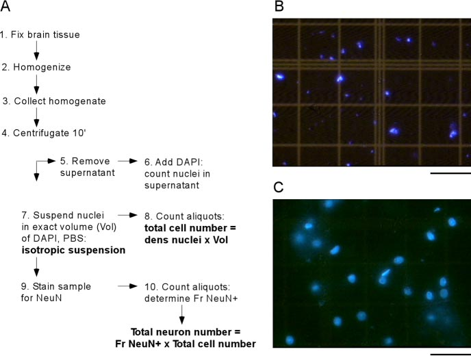
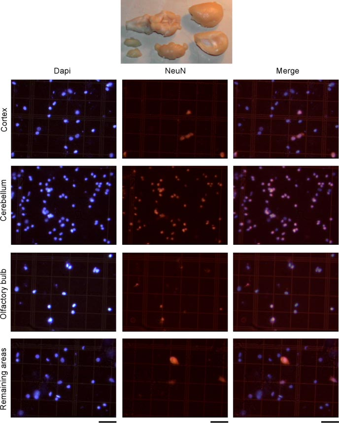

# Digest 2026-06-02

*Generated on June 2, 2026 | Variant B: Detail-First*

---

## Paper 1: Neural Reuse — A Fundamental Organizational Principle of the Brain

**Michael L. Anderson (2010)** *Behavioral and Brain Sciences*

### Abstract

> An emerging class of theories concerning the functional structure of the brain takes the reuse of neural circuitry for various cognitive purposes to be a central organizational principle. According to these theories, it is quite common for neural circuits established for one purpose to be exapted (exploited, recycled, redeployed) during evolution or normal development, and be put to different uses, often without losing their original functions. Neural reuse theories thus differ from the usual understanding of the role of neural plasticity in brain organization: circuits can continue to acquire new uses after an initial function is established; the acquisition of new uses need not involve injury or loss of established function; and the acquisition of a new use need not involve (much) local change to circuit structure.

### a) Experiment & Core Argument

Anderson's target article is a theoretical synthesis, not an empirical experiment. He reviews four specific theories of neural reuse that emerged in the preceding five years:

1. **Neural exploitation hypothesis** (Gallese) — sensorimotor circuits are exploited for conceptual content
2. **Neural reuse in cognitive functioning** (Anderson) — circuits acquire new uses through functional connectivity changes
3. **Massive redeployment hypothesis** — phylogenetically older circuits are redeployed for newer functions
4. **Shared manifold hypothesis** — intersubjectivity grounded in shared neural circuits

The "experiment" here is a massive meta-analysis of neuroimaging data. Anderson reports that from a database of 2,642 activation reports, anatomical regions activate across an average of 5.4 different task domains. Older regions (lower Y-position in cortex) are actually *more* widely activated across domains, not less — the opposite of what strict modularity would predict.

### b) Results (Figure by Figure)

**Key finding 1: Negative correlation between domain specificity and anatomical position**
- Regions higher in the cortex (more "recently" evolved) activate in *fewer* domains, not more
- $r = -0.312$, $p = 0.011$ for the relation between Y-position and number of activating domains

**Key finding 2: Language is the most scattered domain**
- Language tasks activate more broadly scattered regions than visual perception, attention, or action
- This supports the idea that "newer" functions are implemented by combining existing circuits in novel ways

**Key finding 3: Working vs. Use distinction**
- Neural reuse makes a critical distinction between a circuit's "working" (local computational contribution) and its "use" (cognitive purpose in a given task)
- The same working can be put to many different uses through different functional partnerships

### c) Important Methods & Highlighted Points

- Analysis of BrainMap database and NICAM database
- Activation likelihood estimation (ALE) meta-analysis
- Comparison with ACT-R, PDP, and massive modularity architectures

**Author's main takeaway:** The brain is not a collection of dedicated modules. Rather, it is a flexible system where low-level circuits participate in multiple higher-level functions. This has implications for:
- Evolution and development of brain (primate tool use, human language)
- Modularity debate
- Localization of function
- Cortical parcellation problem

### d) Why It Matters

Neural reuse reframes how we think about brain organization. If circuits are routinely reused across domains, then:
- **Localization is not the right framework** — finding that a region lights up during task X doesn't mean it's "for" task X
- **Evolution is more efficient** — new functions can emerge by recombination rather than de novo circuit construction
- **Plasticity is the rule, not the exception** — the brain's functional architecture is inherently dynamic

For Raghavendra specifically: this connects directly to questions about functional specialization in neuroscience and has implications for how we interpret fMRI results and model brain function. The "working vs. use" distinction is a powerful conceptual tool.

---

## Paper 2: One-shot Learning and Behavioral Eligibility Traces in Sequential Decision Making

**Lehmann, Xu, Liakoni, Herzog, Gerstner, Preuschoff (2019)** *eLife*

### Abstract

> In many daily tasks, we make multiple decisions before reaching a goal. In order to learn such sequences of decisions, a mechanism to link earlier actions to later reward is necessary. Reinforcement learning (RL) theory suggests two classes of algorithms solving this credit assignment problem: In classic temporal-difference learning, earlier actions receive reward information only after multiple repetitions of the task, whereas models with eligibility traces reinforce entire sequences of actions from a single experience (one-shot). Here, we show one-shot learning of sequences. We developed a novel paradigm to directly observe which actions and states along a multi-step sequence are reinforced after a single reward. By focusing our analysis on those states for which RL with and without eligibility trace make qualitatively distinct predictions, we find direct behavioral (choice probability) and physiological (pupil dilation) signatures of reinforcement learning with eligibility trace across multiple sensory modalities.

### a) Experiment

The authors designed a 6-state Markov decision process where participants navigate via two actions ('a' or 'b') to a goal state G:
- **State S** (start) → **D2** (2 steps from goal) → **D1** (1 step from goal) → **G** (reward)
- Unbeknownst to participants, the first episode always routes through S → D2 → D1 → G
- Actions are assigned to transitions "on the fly" during the first episode
- Three conditions: **spatial** (checkerboard locations), **sound** (unique tones), **clip-art** (unique images)
- 12 minutes per session, 22 (spatial), 15 (sound), and 12 (clip-art) participants

**The critical comparison:** After a single reward at G in episode 1, do participants show learning at D2 (2 steps back) in episode 2?

- **Null hypothesis (TD-0, no eligibility trace):** Only D1 is reinforced; D2 should show 50% chance-level behavior
- **Alternative (eligibility trace):** Both D1 and D2 should show action biases toward the rewarded sequence

### b) Results (Figure by Figure)

**Figure 1 — Experimental Design and Hypothesis**
- Panel (a): State-action sequences for episodes 1 and 2
- Panel (b): Predictions — null hypothesis shows no change at D2; alternative shows learning at both D1 and D2

**Figure 2 — A Single Delayed Reward Reinforces State-Action Associations**
- Panel (a-c): Environment structure and testing protocols
- Panel (d): Three stimulus conditions
- Panel (e): **D1 action bias** — strong repetition of correct action in episode 2 across all conditions (expected by both hypotheses)
- Panel (f): **D2 action bias** — 85% correct action repetition, significantly above 50% chance ($p < 0.001$). This is the **smoking gun** — only eligibility trace models predict this.

**Figure 3 — Control Experiment Without Reward**
- Participants visit D2 twice with no reward between visits
- Action repetition bias: only 56% ($p = 0.45$, not significant vs. chance)
- This rules out pure memorization; the reward is necessary for the D2 bias

**Figure 4 — Pupil Dilation Evidence**
- Pupil responses at D1 and D2 are significantly larger in episode 2 than episode 1
- Effect holds across all three sensory modalities
- Luminance-controlled; the effect is not a visual artifact

**Figure 5 — Second Control (Passive Observation)**
- Participants passively watch state sequences from main experiment
- No significant pupil difference at D2 between episodes
- Rules out novelty/familiarity as the explanation

**Figure 6 — TD-Error Modulates Pupil Dilation**
- High TD-error transitions → larger pupil dilation
- Effect is invariant across stimulus modalities
- Suggests pupil tracks a learning signal, not just arousal

**Figure 7 — Eligibility Trace Time Scale**
- Best-fitting model: Q(λ) with λ ≈ 0.5
- Time constant τ ~ 10 seconds
- The trace decays over roughly 10s, matching the behavioral effects

### c) Important Methods & Highlighted Points

- **Pupillometry:** 300 ms stimulus display; pupil diameter tracked at 1000 Hz (spatial/clip-art) or 500 Hz (sound)
- **Model fitting:** Q-learning with and without eligibility trace; AIC/BIC model comparison
- **FDR correction:** For multiple comparisons in pupil time-series

**Author's main takeaway:** Humans show genuine one-shot learning in multi-step decision tasks. This learning is accompanied by physiological signatures (pupil dilation) consistent with reinforcement learning models that include eligibility traces. The time scale of the behavioral eligibility trace is on the order of ~10 seconds.

### d) Why It Matters

This paper provides **direct behavioral and physiological evidence** for a core mechanism in reinforcement learning that has been debated for decades. Eligibility traces are well-known in computational models and synaptic physiology, but this is one of the first studies to show:

1. **One-shot learning in humans** for sequences of actions
2. **Pupil dilation as a readout** of value propagation backward through a sequence
3. **A 10-second time scale** for the behavioral eligibility trace

For Raghavendra: This connects RL theory to human behavior and physiology in a clean, falsifiable way. The use of pupil dilation as a proxy for internal RL variables is a methodological insight that could be applied to other learning paradigms.

---

## Paper 3: Isotropic Fractionator — A Simple, Rapid Method for Quantifying Total Cell and Neuron Numbers in the Brain

**Herculano-Houzel & Lent (2005)** *Journal of Neuroscience*

### Abstract

> Stereological techniques that estimate cell numbers must be restricted to well defined structures of isotropic architecture and therefore do not apply to the whole brain or to large neural regions. We developed a novel, fast, and inexpensive method to quantify total numbers of neuronal and non-neuronal cells in the brain or any dissectable regions thereof. It consists of transforming highly anisotropic brain structures into homogeneous, isotropic suspensions of cell nuclei, which can be counted and identified immunocytochemically as neuronal or non-neuronal. Estimates of total cell, neuronal, and non-neuronal numbers can be obtained in 24 h and vary by <10% among animals. Because the estimates obtained are independent of brain volume, they can be used in comparative studies of brain-volume variation among species.

### a) Experiment / Method

The isotropic fractionator is a **10-step method** that turns brain tissue into a countable suspension of nuclei:

1. Fix brain in paraformaldehyde
2. Dissect into regions (olfactory bulb, cortex, cerebellum, rest)
3. Homogenize in dissociation solution (sodium citrate + Triton X-100)
4. Centrifuge to collect nuclei
5. Stain with DAPI (fluorescent DNA dye)
6. Count nuclei density in hemocytometer
7. Calculate total cells = density × suspension volume
8. Immunostain aliquot for NeuN (neuronal nuclear antigen)
9. Count NeuN+ vs NeuN- nuclei under fluorescence
10. Calculate neuronal and non-neuronal totals

**Key assumption:** Every cell has exactly one nucleus.

**Time:** 2 hours for total cell count; 24 hours for neuronal/non-neuronal breakdown.

### b) Results (Figure by Figure)

**Figure 1 — The Isotropic Fractionator Method**
- Panel A: Schematic of the 10-step procedure
- Panel B: Suspension from *unfixed* tissue → nuclear destruction (bad)
- Panel C: Suspension from *fixed* tissue → intact nuclei with preserved morphology (good)
- **Takeaway:** Fixation is critical; unfixed tissue destroys nuclei

**Figure 2 — NeuN Staining in Different Brain Regions**
- DAPI-stained nuclei (left), NeuN+ nuclei (center), merged (right)
- Proportion of NeuN+ nuclei varies dramatically by region:
  - Cerebellum: ~83% neurons
  - Cortex: ~41% neurons
  - Olfactory bulb: ~54% neurons
  - Remaining areas: ~28% neurons

**Table 1 — Cellular Composition of the Adult Rat Brain**
- **Total cells:** 331.65 ± 8.84 million
- **Total neurons:** 200.13 ± 12.17 million (60% of all cells)
- **Cerebellum alone:** 168 million cells, 139 million neurons (~70% of all brain neurons!)
- **Cortex:** 77 million cells, only 31 million neurons
- **CVs < 10%** across animals for most regions — highly reproducible

### c) Important Methods & Highlighted Points

- **Mechanical dissociation** in Tenbroeck homogenizer (not enzymatic — faster, cheaper)
- **DAPI** for total nuclei; **NeuN immunocytochemistry** for neuronal identification
- **Hemocytometer counting** at 400× magnification
- **Independent of volume** — the key advantage over stereology for comparative studies

**Author's main takeaway:** Glial cells are **not** the majority in the rat brain. Neurons outnumber glia (~200M vs ~132M). The cerebellum contains almost 70% of all neurons despite being only 15% of brain weight. This overturns a common textbook assumption.

### d) Why It Matters

This method enabled a revolution in comparative neuroscience. By providing absolute cell numbers independent of brain volume, Herculano-Houzel's lab went on to show:

- **Brain size is a poor predictor of neuron number** across species
- **Humans have ~86 billion neurons** (not the previously cited 100B)
- **The human cerebellum has ~69 billion neurons** alone
- **Primates scale neuron number faster than rodents** as brain size increases
- **Metabolic cost scales with neuron number**, explaining why large brains are energetically expensive

For Raghavendra: This paper is a methodological cornerstone. The isotropic fractionator transformed comparative neuroanatomy from a volume-based to a cell-count-based science. The finding that neurons outnumber glia and that the cerebellum dominates the neuronal count is counterintuitive and has shaped modern understanding of brain scaling.

---

## Notes

- **Papers selected from:** Behavior and Psychology Notes.md, Keep Inbox.md, Misc Recommendations.md
- **Variant:** B (Detail-First)
- **Mistral OCR** used for PDF extraction
- **Images saved to:** `content/images/digest/2026-06-02/`
