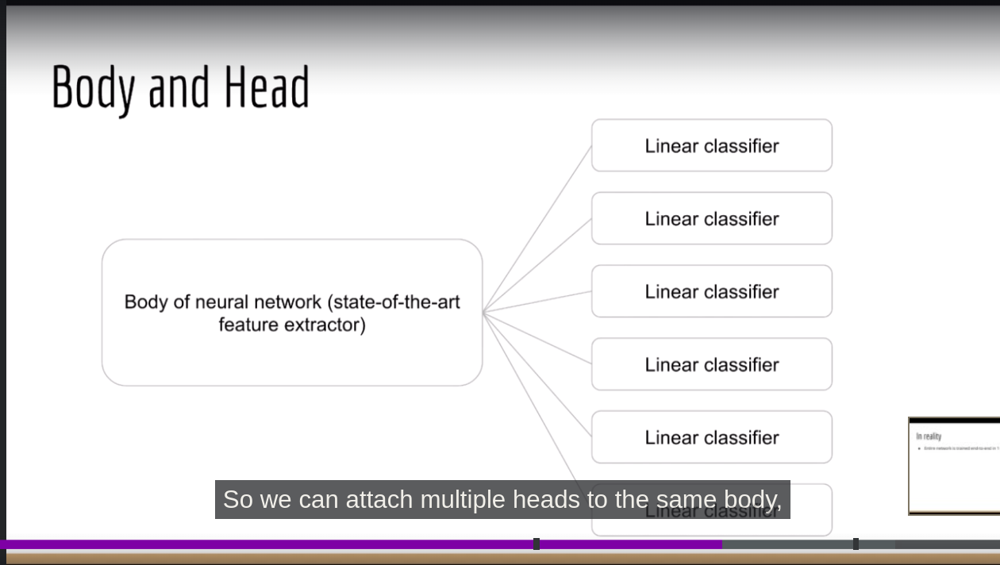

# [[AI Resources]]
# [[ Pytorch ]]

# [[ Memory Networks ]]

# [[Data  analysis & Stats Notes]]

# [[ RL ]]

# ANN
## Xavier's initialization
- Initialize weights and biases such that gradients don't explode and vanish
- code wise, rand weight matrix should be scaled by sqrt(2/second dimension of weight matrix)
## Doing backprop only after a batch
- Backprop must be done after a forward pass of a batch, but NOT of a single example
- The error to single example can be noisy and doesn't give an overall idea of how much model has learnt

## Batch norm
- In a single batch, take activation of a neuron in all batches. get the mean and variance. subtract the outputs from mean and scale by variance.
- Do the above for all neurons
- the pass into into a linear output gamma * scaled input + beta
- then pass into an activation func
- While testing - either ignore Batch norm OR using all past activations during training

## Optimizers
1. SGD
After a batch
param -= learning_rate  * param.grad

2. RMS prop
  the learning rate can be scaled such that the updates are small when the gradient has been large and updates are large, when gradient has been small.
So keep track of squared gradient = take moving avg such that more weightage is given to past
i) Initialize the square grad to zero
`square_grad = {name: torch.zeros_like(param) for name, param in model.named_parameters()}`

ii) calculate moving avg of square grad
```
            for name, param in model.named_parameters():
                # print('here')
                square_grad[name] = 0.9*square_grad[name] + (1 - 0.9)*(param.grad**2)
```

for each parameter scale the learning rate using the moving avg of squared grad
```
param -= (learning_rate * (param.grad))/(torch.sqrt(square_grad[name]) + epsilon)
```
  3. Adam optimizer
Default popular optimizer
- **Use moving avg of both gradient and square of gradient**
- Initialize to zeros just like before
```
square_grad = {name: torch.zeros_like(param) for name, param in model.named_parameters()}
just_grad = {name: torch.zeros_like(param) for name, param in model.named_parameters()}
```
- Calculate moving avg of gradient and square gradient giving more weightage to past
```
just_grad[name] = beta1*(just_grad[name]) + (1-beta1)*(param.grad)
square_grad[name] = beta2*(square_grad[name]) + (1-beta2)*(param.grad**2)
```

- but u can't use them directly, as they wil be initally biased towards zero because they are initialized to zero initially, so u have to apply a correction that slowly vanishes  with time.
```
 # corrected bias due to zero initialization
                m_corrected = just_grad[name]/(1 - beta1**t)
                v_corrected = square_grad[name]/(1-beta2**t)
```
- Now, update param based on moving avg of grad but scaled by moving avg of grad squared, *but the zero bias corrected ones*
```
param -= (learning_rate*m_corrected) / (torch.sqrt(v_corrected) + epsilon)
```

## Practice Links 
https://www.gptandchill.ai/codingproblems

## Udemy Course notes

- Viewing Neural networks as 2 part system - feature extractor + classifier. In case, u want to do multi-class detection(class1 and class2 are the answer)


- In RNN, spam classification tasks, y(t_end) only matters because only then whole input sequence has been processed
- In some cases, max of all h(t) is enough because crucial information may be at the beginning and it can be at maximum ???

