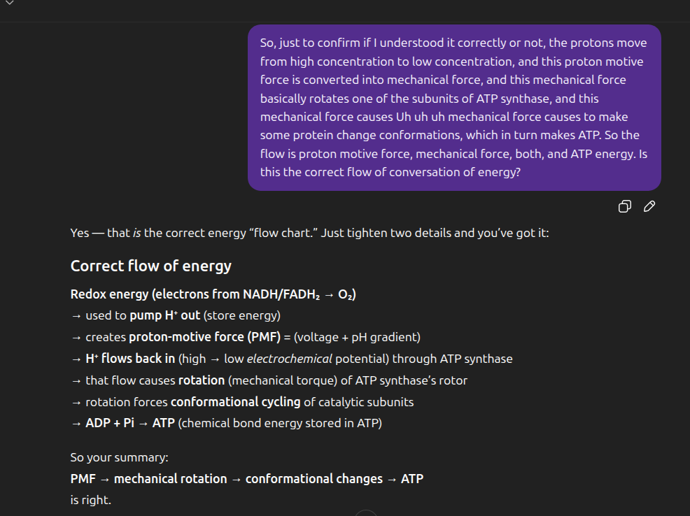
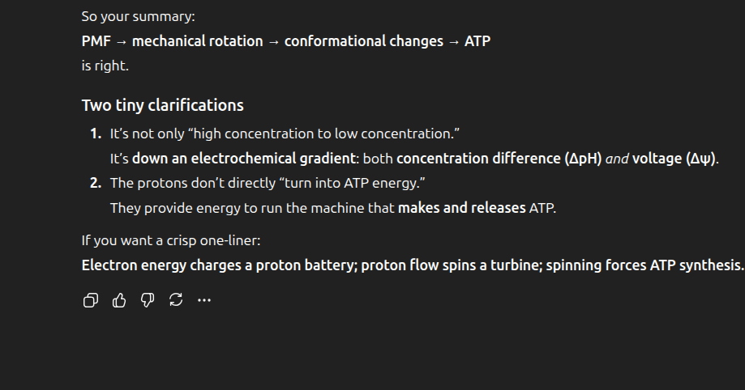

# The Vital Question

Imported from Google Keep on 2026-03-23.

## Imported images from Keep

## 2026-04-19 — alkaline vent metabolism chat

Unrolled from a shared ChatGPT conversation titled **Alkaline Vent Metabolism**.

### User formulation

- According to Nick Lane, alkaline hydrothermal vents provided a natural proton gradient.
- That gradient could drive early metabolism / help H2 and CO2 react.
- Leaky membranes mattered because equilibrium was not simply allowed to settle.
- Modern enzymes like ECH were taken as part of the picture.

### Cleaned-up version of the idea

According to Lane, life may have originated in **alkaline hydrothermal vents** because they provided:

1. **A redox disequilibrium** — abundant **H2** from vents and **CO2** from the ocean.
2. **A natural proton gradient** — alkaline vent fluid against relatively more acidic ocean water.
3. **Catalytic mineral barriers** — especially **Fe(Ni)S-rich** microporous walls.
4. **Initially leaky compartments / membranes** — so early systems could depend on an externally supplied gradient rather than generating and sealing their own from the start.

### Important refinements / caveats

- The claim is **not** just “proton gradients + catalysts = life.”
- Proton gradients would have helped drive **early protometabolism / carbon fixation**, not by themselves magically produce full life.
- The vent system is better thought of as an **open-flow geochemical disequilibrium** maintained by geology, not a one-shot battery.
- “Leaky membranes” are useful in this picture because the gradient is continuously supplied by the vent environment.
- Modern proteins such as **energy-converting hydrogenase (Ech)** are better treated as **descendants / analogical clues** than as literally present from the start.

### Short version

- **H2 + CO2** provide the redox disequilibrium.
- **Natural proton gradients** across vent barriers provide directional energetic bias.
- **Fe(Ni)S compartments** act like catalytic, semi-cell-like structures.
- Early systems were probably **proton-leaky**, which only works because geology kept supplying the gradient.
- The model is about the origin of **protometabolism first**, with heredity, tighter membranes, and full cellular machinery coming later.
